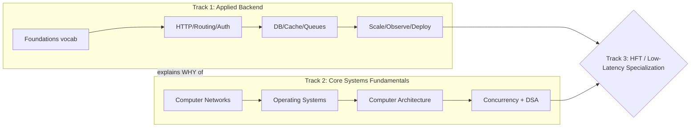

# The Master Roadmap — From Foundations to Core / HFT-Grade Backend

> **⚡ Overwhelmed? Don't execute this file.** This is the *map* (the whole
> mountain). To actually start, open **[`plans/week-01.md`](./plans/week-01.md)** —
> your day-by-day route for this week. This roadmap is the horizon; the week plan
> is Monday morning.

> **Who this is for.** Anyone rebuilding CS fundamentals from the
> ground up to land a **top-tier backend / systems / HFT role**. You're
> strong at learning but new to the *systems* layer: computer
> networks, operating systems, and computer architecture. This file is the single
> thread that tells you **what to study, in what order, and why** — everything
> else in this repo hangs off it.

---

## 0. The honest framing (read this first)

There are **two different games**, and you need both:

1. **Applied backend engineering** — HTTP, routing, auth, databases, caching,
   queues, observability, scaling. This is what the Sriniously playlist and this
   repo's `kb/` teach. It gets you a *good* backend job.
2. **Core CS systems fundamentals** — computer networks, operating systems,
   computer architecture, data structures & algorithms, concurrency. This is what
   separates a *good* backend engineer from a **systems / HFT / staff-track**
   engineer. It is what FAANG-abroad and HFT interviews actually grind you on, and
   it is the part a framework will *never* teach you.

The applied course is excellent but it **assumes** the systems layer. HFT in
particular is a different beast: it is dominated by **latency**, **C++**,
**lock-free concurrency**, **CPU cache behavior**, **kernel-bypass networking**,
and **mechanical sympathy** (writing code that respects how the hardware works).
No amount of "build a REST API" gets you there. So this roadmap runs **two tracks
in parallel** and tells you how they interleave.



**Rule of thumb:** spend ~60% of your study time on Track 2 (systems) and ~40% on
Track 1 (applied) until the systems gaps close. Applied concepts stick far faster
once you understand the machine underneath them.

---

## 1. How this repo is organized (your map)

| Folder | What it is | When to use it |
|--------|-----------|----------------|
| [`foundations/`](./foundations/) | Plain-English vocabulary (IP, ports, HTTP, DNS, TLS, DB pools, CORS). Read **01 → 15 in order**. | **Now.** This is your on-ramp. |
| [`notes/`](./notes/) | Raw + deepened lecture notes from the playlist. | While/after watching each video. |
| [`network-qa/`](./network-qa/) | Deep-dive Q&A on specific networking puzzles (why IPs change, packet loss/ordering). | When a networking idea won't click. |
| [`kb/`](./kb/) | The **curated knowledge base** — one rigorous first-principles file per topic, with a beginner→senior pitfalls ladder. The "brain" the agent reads. | The canonical reference. Grows over time. |
| [`agents/`](./agents/) & [`.opencode/`](./.opencode/) | The AI tutor (portable prompt + opencode agent/skill). | Ask it questions; it reads `kb/`. |

**The single reading thread (Track 1, near-term):**

```
foundations/00-index.md  (the big picture)
  → foundations/01 … 15   (vocabulary, in order)
  → notes/01-roadmap-notes.md   (the whole syllabus)
  → notes/03-what-is-backend.md + notes/3.1-deepening.md + notes/3_questions.md
  → kb/01-what-is-a-backend.md   (the rigorous version — this is the standard every future kb file should meet)
  → then: HTTP (playlist V5) → kb/02-http.md  (to be written)
```

---

## 2. Track 1 — Applied Backend (the playlist + this KB)

You're **on foundations** now. Here is the phased path. Each phase = "watch the
videos, take notes in `notes/`, then consolidate into a `kb/` file that meets the
`kb/01` standard." The KB index lives in [`kb/README.md`](./kb/README.md).

| Phase | Topics | KB files | Milestone (you can…) |
|-------|--------|----------|----------------------|
| **0. Foundations** ← you are here | The `foundations/` vocab + "what is a backend" | `kb/01` | Draw a request's full path from browser to handler and back, naming every hop. |
| **1. The wire** | HTTP (methods, headers, status, caching, HTTP/1.1→2→3), TLS | `kb/02` | Read a raw HTTP exchange; explain HOL blocking and why HTTP/3 uses QUIC/UDP. |
| **2. Request handling** | Routing, serialization, validation | `kb/03,04,06` | Explain how a URL maps to code and how bytes ↔ objects (and the failure modes). |
| **3. Identity** | Auth & authorization (sessions, JWT, OAuth2, RBAC) | `kb/05` | Compare stateful vs stateless auth and defend against CSRF/XSS/timing attacks. |
| **4. Pipeline** | Middleware, request context, handlers/MVC | `kb/07,08,09` | Reason about middleware ordering and request-scoped state/cancellation. |
| **5. Data** | REST design, databases (ACID, indexing, txns), BLL | `kb/10,11,12` | Design a schema, kill an N+1, reason about isolation levels. |
| **6. Async & perf** | Caching, queues, search, emails | `kb/13,14,15,16` | Pick a cache strategy + eviction policy; move slow work to a queue with retries. |
| **7. Resilience/ops** | Errors, config, observability, graceful shutdown, security | `kb/17–21` | Instrument logs/metrics/traces; shut down without dropping in-flight requests. |
| **8. Scale & ecosystem** | Scaling, concurrency, object storage, realtime, testing, 12-factor, OpenAPI, webhooks, DevOps | `kb/22–30` | Reason about horizontal scaling, backpressure, and deployment strategies. |

> **The KB standard.** Every `kb/` file should match `kb/01`: TL;DR → the problem
> it solves → first-principles mental model → core concepts table → where it fits
> the request lifecycle → **beginner / intermediate / senior pitfalls ladder** →
> "how frameworks hide this" → self-check questions. If a new file doesn't have
> the pitfalls ladder and the "curtain" section, it isn't done.

---

## 3. Track 2 — Core Systems Fundamentals (the part that gets you the offer)

This is the track your target roles actually test and the one you said you're
weak on. Do these **in parallel** with Track 1. Canonical resources are listed —
these are the standard references, not random blogs.

### 3.1 Computer Networks
*Why for you:* every backend concept is networking zoomed in; HFT lives and dies
on network latency. This is your strongest lever because it directly overlaps
Track 1's foundations.

- **Book:** *Computer Networking: A Top-Down Approach* — Kurose & Ross.
- **Hands-on:** Beej's *Guide to Network Programming* (write raw sockets in C).
- **Must be able to explain cold:**
  - TCP 3-way handshake, connection teardown, TCP state machine, `TIME_WAIT`.
  - TCP flow control (sliding window) vs congestion control (slow start, AIMD,
    CUBIC, BBR); Nagle's algorithm and `TCP_NODELAY`.
  - Head-of-line blocking at TCP and HTTP layers; why QUIC/HTTP-3 moved to UDP.
  - What actually happens on packet loss, reordering, and retransmission.
  - DNS resolution end-to-end; why an IP can change (see `network-qa/01`).
  - The difference between latency, bandwidth, throughput, jitter.
- **Do:** implement a tiny TCP echo server + client in C using raw `socket()`,
  `bind()`, `listen()`, `accept()`, `recv()`. This single exercise demystifies
  half of backend.

### 3.2 Operating Systems
*Why for you:* the OS is what your server *runs on*; latency, concurrency, and
resource limits are all OS behavior. HFT is largely "fighting the OS" (pinning
cores, avoiding context switches, bypassing the kernel).

- **Book:** *Operating Systems: Three Easy Pieces* (OSTEP) — free online, the best
  intro that exists.
- **Must be able to explain cold:**
  - Process vs thread; virtual memory, paging, TLB, page faults.
  - Context switches (what they cost and why HFT avoids them).
  - CPU scheduling; user space vs kernel space; system calls.
  - Concurrency primitives: mutex, semaphore, condition variable; deadlock.
  - How I/O works: blocking vs non-blocking, `epoll`/`kqueue`, the event loop
    (this is the *real* explanation of Node's model in `foundations/05`).
  - File descriptors, sockets as FDs, `ulimit`, why "too many open files" happens.
- **Do:** write a program using `epoll` to handle many sockets in one thread. Now
  you understand nginx and Node from first principles.

### 3.3 Computer Architecture (the HFT differentiator)
*Why for you:* this is where "core backend in the AI era" and HFT actually
diverge from web-dev. Mechanical sympathy = knowing the machine.

- **Book:** *Computer Systems: A Programmer's Perspective* (CSAPP) — the single
  most valuable book for this goal. Do the labs.
- **Must be able to explain cold:**
  - Memory hierarchy: registers → L1/L2/L3 cache → RAM → disk, and the *latency
    numbers* for each (know "Latency Numbers Every Programmer Should Know").
  - Cache lines (64 bytes), cache misses, spatial/temporal locality, why array
    traversal beats linked-list traversal, **false sharing**.
  - Branch prediction and branch misprediction cost.
  - How data layout (struct-of-arrays vs array-of-structs) changes performance.
  - Instruction pipelining, out-of-order execution, SIMD (at a conceptual level).
  - NUMA (why which core touches which memory matters at scale).
- **Do:** benchmark row-major vs column-major matrix traversal in C/C++ and
  *measure* the cache-miss penalty. Seeing a 5–10× difference from data layout
  alone is the "aha" that HFT is built on.

### 3.4 Data Structures, Algorithms & Concurrency
*Why for you:* the interview gate everywhere, and the foundation of low-latency
data structures.

- **DSA:** solid competitive-DS foundations (if you already have these,
  refresh via LeetCode patterns + *Elements of Programming Interviews*).
- **Concurrency (deep):** *Java Concurrency in Practice* (concepts) and/or
  *C++ Concurrency in Action* (Anthony Williams) for the HFT-relevant version.
  - Memory models, atomics, `std::atomic`, memory ordering (acquire/release).
  - Lock-free / wait-free data structures; the disruptor pattern (LMAX).
  - Why locks are expensive; when a spinlock beats a mutex.

---

## 4. Track 3 — HFT / Low-Latency Specialization (later, but aim here)

Start this only after Tracks 1–2 are solid. It's the destination, not the
starting point.

- **Language:** modern **C++ (17/20)** is the lingua franca of HFT; Rust is rising.
  Deep C++: *Effective Modern C++* (Meyers), then the concurrency book above.
- **Mechanical sympathy:** Martin Thompson's talks/blog; the LMAX Disruptor paper.
- **Kernel-bypass networking:** DPDK, Solarflare/Onload, `AF_XDP` — how HFT firms
  skip the kernel to shave microseconds.
- **Measurement:** `perf`, flame graphs, cache-miss profiling, histogram latency
  (HdrHistogram), tail latency (p99/p999/p9999 — averages are useless here).
- **Domain:** market data feeds, order books, matching engines, FIX protocol,
  time synchronization (PTP).
- **Mindset shift:** in web backend you optimize *throughput and cost*; in HFT you
  optimize the **worst-case latency of the hot path**, and you'll rewrite code to
  avoid a single allocation or cache miss.

---

## 5. A realistic cadence

You don't need to finish Track 2 before starting Track 1 — interleave. A sample
week while you're in the foundations phase:

- **Mon–Tue:** Track 1 — 1 playlist video + notes + start/continue its `kb/` file.
- **Wed–Thu:** Track 2 — OSTEP or Kurose-Ross chapter + the matching hands-on
  exercise (sockets, `epoll`, cache benchmark).
- **Fri:** CSAPP / architecture — one concept + measure it.
- **Weekend:** DSA practice (2–3 problems) + review the week's `kb/` file by
  teaching it aloud (the self-check questions in each `kb/` file).

**Consolidation loop (non-negotiable):** learn → build/measure the tiny thing →
write it up in `kb/` in your own words → have the agent quiz you. Passive video
watching will not get you to 50+ LPA; *building and explaining* will.

---

## 6. What "50+ LPA / abroad / HFT" interviews actually test

So you know what you're aiming the tracks at:

1. **DSA** — the gate. Non-negotiable, medium-hard fluency.
2. **Systems fundamentals** — CN/OS/architecture questions above, asked *deeply*
   ("what happens when you type a URL" but they keep asking "and then?" for 45
   minutes). Track 2 is exactly this.
3. **System design** — design a rate limiter / URL shortener / news feed / order
   book. Track 1's `kb/` scaling/caching/queues files feed this.
4. **Low-level / HFT-specific** — cache behavior, lock-free structures, latency
   measurement, C++ internals. Track 3.
5. **Depth of one thing** — pick a topic and be able to go 5 levels deep. The
   `kb/` pitfalls ladders are designed to build exactly this depth.

---

## 7. Immediate next actions

1. Finish reading [`foundations/`](./foundations/) 01 → 15 in order (you're mid-way).
2. Re-read [`kb/01-what-is-a-backend.md`](./kb/01-what-is-a-backend.md) — treat its
   §8 senior pitfalls as a checklist of things to eventually understand deeply.
3. Start Track 2 in parallel: **OSTEP intro chapters** + write the **TCP echo
   server in C** (this one exercise pays off across both tracks).
4. When you watch the HTTP video (V5), we consolidate it into `kb/02-http.md` at
   the `kb/01` standard.

> This roadmap is a living document. As the KB grows and your gaps close, we
> revise the ratios and move you toward Track 3.
