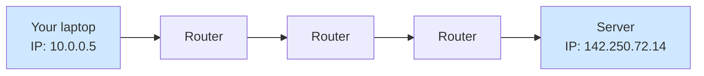

# 01 — The Internet, Networks, and IP Addresses

> **Goal:** Understand how two computers anywhere in the world can send messages to each other.

---

## Plain definition

- A **network** is two or more computers connected so they can share data (your home Wi-Fi is a small network).
- The **internet** is the *giant global network* that connects millions of smaller networks together.
- Every device on a network has a unique address called an **IP address** (like `142.250.72.14`), so messages know where to go.

---

## The postal-system analogy

| Internet concept | Postal equivalent |
|-----------------|-------------------|
| Device | A house |
| Network | A neighborhood of houses |
| Internet | The entire global postal system |
| IP address | A street address (`142.250.72.14`) |
| Message (data) | A letter |
| Router | A sorting office that forwards letters toward the destination |

When you send a message, it doesn't travel in one straight line. It **hops** through many "sorting offices" (routers) that each forward it closer to the destination — exactly like a letter routed through postal centers.

---

## What an IP address looks like

There are two common versions:

- **IPv4**: four numbers separated by dots, e.g., `192.168.1.10` or `8.8.8.8`. (This is what the video uses.)
- **IPv6**: longer, e.g., `2001:4860:4860::8888`. (Newer, more addresses.)

You don't need to memorize these; just know an IP address is the **unique ID of a computer on the internet**, like a phone number.

---

## Packets (a detail worth knowing)

Long messages are split into small chunks called **packets**. Each packet travels independently and is reassembled at the destination. This is why the internet is resilient — if one route is down, packets take another.

---

## Why this matters for the course

Video 3 says a request "travels over the internet" from your browser to an AWS server. That sentence hides *all* of the above: your browser's message is chopped into packets, routed across the globe, and reassembled at the server's IP address. Everything else in the course (servers, DNS, firewalls) sits on top of this foundation.

---

## Jargon table

| Term | Meaning |
|------|---------|
| Network | Computers connected to share data |
| Internet | The worldwide network of networks |
| IP address | A device's unique address on a network (e.g., `8.8.8.8`) |
| Router | A device that forwards data toward its destination |
| Packet | A small chunk of a larger message, sent independently |
| IPv4 / IPv6 | Two formats of IP addresses |

---

## Key takeaways

1. The internet connects computers using **IP addresses** as destinations.
2. Data moves in **packets** that hop through routers.
3. An IP address is just a computer's "phone number" on the network.

---

## Quick check (ask yourself)

- If the internet is like the postal system, what is a router? *(Answer: a sorting office.)*
- Why might a single message arrive as many small pieces? *(Packets — for speed and resilience.)*

> Stuck on anything? Ask me before moving to file 02.
