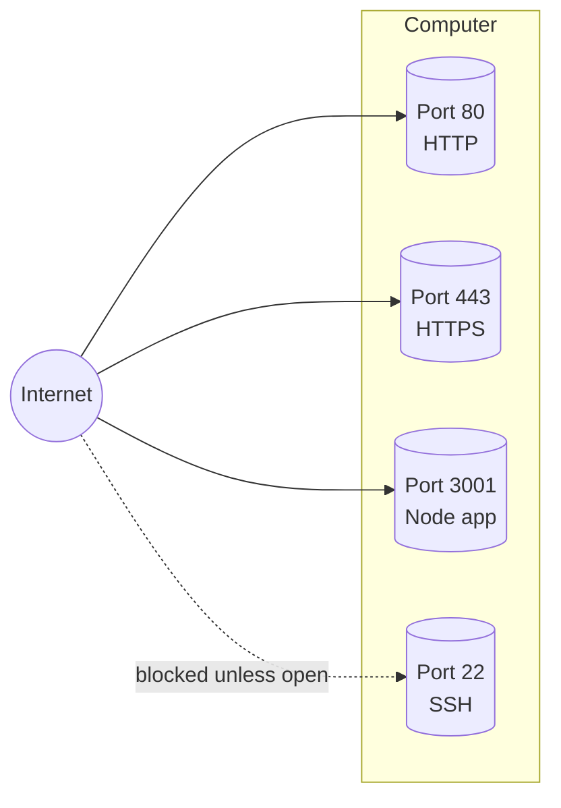
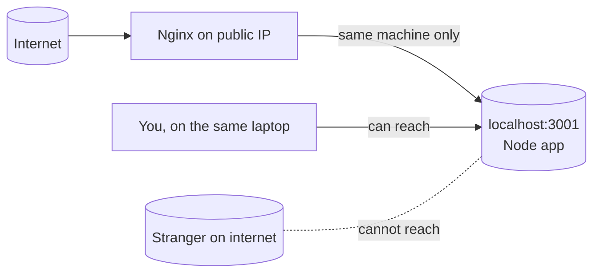

# 02 — Clients, Servers, and Ports (plus localhost)

> **Goal:** Understand the words "server," "client," "port," and "localhost" that Video 3 uses constantly.

---

## Plain definitions

- **Server**: a computer (or program) that *waits* for requests and *responds* to them. ("Server" can mean the machine *or* the software on it — context decides.)
- **Client**: a computer/program that *asks* a server for something. Your **browser** is the most common client.
- **Port**: a numbered "door" on a computer. A server listens on a specific port for incoming requests.
- **localhost**: a nickname meaning "this computer I'm on" (the address `127.0.0.1`).

---

## The restaurant analogy

| Concept | Restaurant equivalent |
|---------|----------------------|
| Client | A customer (you) |
| Server | The waiter / kitchen that takes orders and brings food |
| Request | Your order ("I'd like pasta") |
| Response | The food arriving at your table |
| Port | A specific counter/window the kitchen listens at |

Just like a restaurant has a front counter (port 80/443) and a staff entrance (port 22), a computer has many ports. Only some are open to the public.

---

## Ports explained simply

A computer can do many things at once. **Ports** separate those activities by number:

| Port | Typical use |
|------|-------------|
| 80 | HTTP (normal web traffic) |
| 443 | HTTPS (encrypted web traffic) |
| 22 | SSH (remote login to the computer) |
| 3000, 3001 | Commonly used by developers for their own apps |

In Video 3, the Node app listens on **port 3001** — that's just "the app is sitting at door number 3001 on this computer, waiting for visitors."

---

## localhost vs a public IP

- **localhost / 127.0.0.1** = "me, this machine." A server on `localhost:3001` is reachable *only from the same computer*.
- A **public IP** (e.g., the EC2 address) = reachable from *anywhere on the internet*.

This is why Video 3's Node app on `localhost:3001` is safe: the public internet can't reach it directly; only Nginx (on the same machine) can.

---

## Why this matters for the course

Video 3's whole story is: a request leaves your browser (client), crosses the internet, and arrives at a **server** listening on a **port** (443 → Nginx → 3001). If you don't know what a server/port is, that sentence is gibberish. Now it isn't.

---

## Jargon table

| Term | Meaning |
|------|---------|
| Client | The requester (e.g., your browser) |
| Server | The waiter: waits for requests, sends responses |
| Port | A numbered door on a computer for a specific service |
| localhost | "This computer" (`127.0.0.1`) |
| Public IP | An address reachable from the whole internet |
| Request | A message asking for something |
| Response | The answer/message sent back |

---

## Key takeaways

1. **Client asks, server answers.**
2. A **port** is just a numbered door; servers listen on specific ports.
3. **localhost** means "this machine only" — not reachable from the internet.

---

## Quick check

- Your browser is a ______; the app on AWS is a ______. *(client; server)*
- If an app listens on `localhost:3001`, can a stranger on the internet reach it? *(No — only the same machine can.)*

> Ask me anything before file 03.
