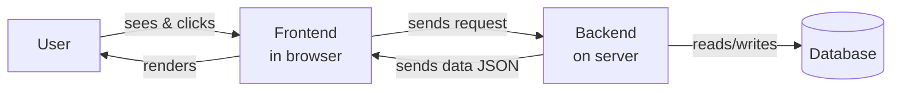

# 03 — Frontend vs Backend (Explained Simply)

> **Goal:** Understand the two halves of every web application, because the whole course is about one of them (the backend).

---

## Plain definition

- **Frontend** = the part the user *sees and clicks*. It runs **in your browser**. (Think: the buttons, colors, text, layout.)
- **Backend** = the part the user *doesn't see*. It runs **on a server** and handles data, rules, and storage. (Think: "save my like," "is this password correct?")

A website is like a restaurant: the **frontend** is the dining room (menu, decor, you placing an order); the **backend** is the kitchen (cooking, inventory, recipes).

---

## Side-by-side

| Aspect | Frontend | Backend |
|--------|----------|---------|
| What it is | The website's UI | The behind-the-scenes logic |
| Where it runs | **Your browser** | **A server (e.g., AWS)** |
| Built with | HTML, CSS, JavaScript | Node.js, Python, Go, databases… |
| Talks to user via | Visuals + clicks | Data (usually JSON) |
| Example job | Show a list of posts | Store a new post in the database |

---

## How they work together

1. You click "Like" (frontend).
2. Frontend sends a request to the backend: "please record a like."
3. Backend saves it in the database and replies "done."
4. Frontend updates the heart icon.

---

## Why the course focuses on the backend

The frontend is what users notice, but the **backend is where the real engineering lives**: data, security, scaling to millions of users, reliability. Video 3's big point: the backend is the **centralized computer that holds everyone's state** (who liked what, who gets a notification). The frontend only shows *your* slice.

---

## A common confusion

> "Isn't the frontend also code on a server? (e.g., Next.js)"

Some frontend tools *pre-render* HTML on a server to send faster — but the code they ship still **runs in your browser** for interactivity. The *backend* is different: its code runs on the server and the browser never sees or runs it. (We'll see this clearly in file 13.)

---

## Jargon table

| Term | Meaning |
|------|---------|
| Frontend | The visible UI; runs in the browser |
| Backend | Hidden logic/data; runs on a server |
| JSON | A common format for sending data (like a labeled list) |
| State | The current data/situation (e.g., who liked what) |
| Full-stack | Someone who works on both frontend and backend |

---

## Key takeaways

1. **Frontend = what you see; Backend = what does the work.**
2. They talk over the network (requests/responses).
3. This course is about mastering the backend.

---

## Quick check

- When you click "submit" on a form, which half sends the request? *(frontend)* Which half decides if it's valid and saves it? *(backend)*

> Ready for file 04? Ask me first if anything's unclear.
