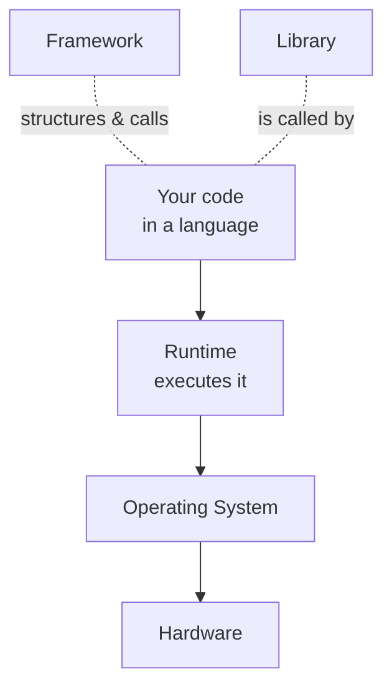

# 04 — Code, Programming Language, Runtime, Framework, Library

> **Goal:** Clear up the words the instructor uses loosely: "code," "language," "runtime," "framework," "library." These confuse almost everyone at the start.

---

## Plain definitions (in order of "bigness")

- **Code**: instructions you write for a computer, in a language it can (eventually) follow.
- **Programming language**: the *rules and vocabulary* for writing code (e.g., JavaScript, Python, Go).
- **Runtime**: the *engine* that actually **executes** your code on a machine. (Example: Node.js runs JavaScript outside a browser; the browser itself is a runtime for JS.)
- **Library**: a collection of pre-written code you can **call** when you need it (like a toolbox). *You call the library.*
- **Framework**: a big structure that **calls your code** and decides the overall flow. *The framework calls you.* (Example: Express for backend, React for frontend.)

---

## The "who calls whom" trick (the easiest way to remember)

| | You call it | It calls you |
|--|-------------|--------------|
| **Library** | ✅ | ❌ |
| **Framework** | ❌ | ✅ |

Example:
- `Math.max(1, 2)` → you **call** the `Math` library.
- In Express (a framework), *you* write `app.get('/users', ...)` but **Express decides when** to run it (when a request arrives). The framework calls you.

---

## Language vs Runtime (the most confusing pair)

The **language** is just the rules. The **runtime** is what makes the code actually run.

| Language | Common runtime(s) |
|----------|-------------------|
| JavaScript | Browser, or **Node.js** (on a server) |
| Java | JVM (Java Virtual Machine) |
| Python | CPython interpreter |
| Go | The Go runtime (compiled) |

> This is why Video 3 can say "Node server": JavaScript (language) is executed by **Node.js** (runtime) on a server.

---

## Why Video 2/3 care about this

Video 2 said the course teaches **language-agnostic** skills and will implement in **Node.js and Golang**. That means:
- **Language-agnostic** = the *concept* (caching, auth) doesn't depend on JavaScript vs Go.
- The **runtime** (Node vs Go runtime) is where those concepts become real, runnable code.

---

## Jargon table

| Term | Meaning |
|------|---------|
| Code | Instructions for a computer |
| Language | Syntax/rules for writing code (JS, Python, Go) |
| Runtime | The engine that executes code (Node.js, browser, JVM) |
| Library | Reusable code you call (a toolbox) |
| Framework | A structure that calls your code and sets the flow |
| Driver | (preview) code that lets your program talk to a database (file 12) |

---

## Key takeaways

1. **Language** = rules; **Runtime** = what runs your code.
2. **Library** = you call it; **Framework** = it calls you.
3. Node.js is the *runtime* that lets JavaScript run as a backend server.

---

## Quick check

- "React" is a ______; "a function that formats a date" is a ______. *(framework; library)*
- What executes JavaScript on a server? *(Node.js — a runtime)*

> Ask me before moving to file 05 (Node.js & servers).
