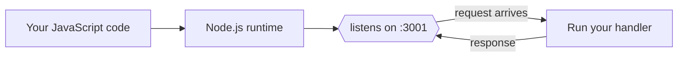

# 05 — Node.js and What "Running a Server" Means

> **Goal:** Demystify "Node server on port 3001" — the exact phrase Video 3 repeats. By the end you'll run one yourself.

---

## Plain definitions

- **Node.js (Node)**: a **runtime** that lets you run **JavaScript** on a server (not just in a browser). It's the engine; JavaScript is the language.
- **"Running a server"**: starting a program that *listens* on a port for incoming requests and replies to them.

So a "Node server" = a JavaScript program running inside Node.js that waits for requests.

---

## Why Node matters here

Normally JavaScript only ran in browsers. **Node.js** (created in 2009) brought JS to servers. The instructor uses Node because:
- It's popular for backends.
- It uses the *same language* as the frontend (JavaScript), which is convenient.

But remember from file 04: the **concept** (a server that listens and replies) is the same in any language (Python, Go, Ruby). Node is just the tool in this course.

---

## Tiny mental model



---

## See it for real (you can run this)

Create a file `hello-server.js`:

```js
// 1. Import Node's built-in HTTP module
const http = require('http');

// 2. Create a server: a function that runs for every request
const server = http.createServer((req, res) => {
  res.writeHead(200, { 'Content-Type': 'text/plain' });
  res.end('Hello! You reached the backend.');
});

// 3. Start listening on port 3001 of THIS computer
server.listen(3001, () => {
  console.log('Backend is running at http://localhost:3001');
});
```

Run it (you need Node installed — ask me if you don't have it):
```
node hello-server.js
```
Now open `http://localhost:3001` in your browser. **You just ran a backend server.** 🎉

> This is *literally* what Video 3's `localhost:3001` app is — just bigger.

---

## What `localhost:3001` means, word by word

- `localhost` = this computer (file 02).
- `3001` = the port the server is listening on (file 02).
- Together: "the server program running on this machine, door number 3001."

---

## pm2 (a word from the video)

The instructor used **pm2** to keep the server running and manage multiple apps (frontend + backend). Think of pm2 as a "babysitter" that restarts your app if it crashes and lets you run several at once. You don't need it for learning — `node hello-server.js` is enough.

---

## Why this matters for the course

Video 3's entire demo is: a Node app listening on `localhost:3001`, hidden behind Nginx, reachable from the internet via a domain. Once you've run the 10-line server above, that sentence is concrete, not abstract.

---

## Jargon table

| Term | Meaning |
|------|---------|
| Node.js | Runtime that runs JavaScript on servers |
| Node server | A JS program in Node that listens for requests |
| `require` | How Node imports built-in/modules (e.g., `http`) |
| `listen(3001)` | Start waiting for requests on port 3001 |
| pm2 | A process manager that keeps Node apps alive |

---

## Key takeaways

1. **Node.js** runs JavaScript on a server.
2. "Running a server" = a program **listening on a port** for requests.
3. You can build one in ~10 lines of JavaScript.

---

## Quick check

- What's the difference between JavaScript in a browser and JavaScript in Node? *(Same language, different runtime — browser vs server.)*
- After `server.listen(3001)`, where would you point your browser? *(http://localhost:3001)*

> Want help installing Node or running the example? Just ask. Otherwise, on to file 06 (HTTP).
