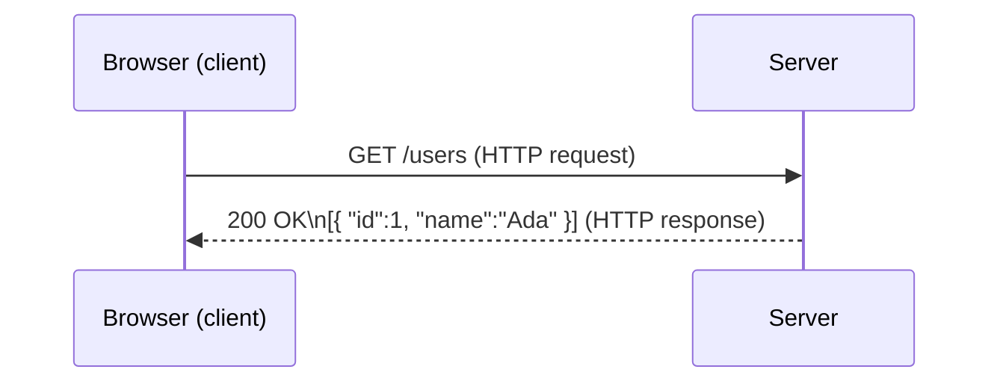

# 06 — HTTP: Requests and Responses (Basics)

> **Goal:** Understand the "language" your browser and a backend use to talk. This is THE foundation of the whole course (Video 5 is entirely about it).

---

## Plain definition

**HTTP** (HyperText Transfer Protocol) is the **rules** for how a client (browser) and a server exchange messages on the web. Every time you load a page or call an API, HTTP is used.

A conversation has two parts:
- **Request**: the message *from* client *to* server (e.g., "give me the list of users").
- **Response**: the message *from* server *back* (e.g., the list of users, or "not found").

---

## The letter analogy

| HTTP part | Letter equivalent |
|-----------|-------------------|
| Request line / method | The action ("please SEND me…") |
| URL | The address |
| Headers | The envelope metadata (from, type) |
| Body | The contents of the letter |
| Status code | Did it arrive? (200 = yes, 404 = wrong address) |

---

## URL — the address

A URL like `https://backend.demo.xyx/users` breaks into:

```
https://   backend.demo.xyx   /users
  │              │              │
protocol      domain         path
(HTTPS)     (which server)  (what you want)
```

---

## Methods — the "verb" of a request

| Method | Meaning | Like… |
|--------|---------|-------|
| GET | Read / fetch data | "Show me" |
| POST | Create / send data | "Here's a new thing" |
| PUT / PATCH | Update data | "Change this" |
| DELETE | Remove data | "Delete that" |

> These map to CRUD (Create/Read/Update/Delete) — a term from the roadmap (Video 1).

---

## Status codes — the server's reply code

| Code | Meaning |
|------|---------|
| 200 | OK (success) |
| 201 | Created (something new was made) |
| 400 | Bad request (you sent something wrong) |
| 401 | Unauthorized (not logged in) |
| 404 | Not found (wrong address) |
| 500 | Server error (something broke on the server) |

---

## Headers & Body

- **Headers**: extra info (e.g., `Content-Type: application/json` = "the body is JSON").
- **Body**: the actual data (often JSON). Example request body to create a user:
```json
{ "name": "Ada", "email": "ada@example.com" }
```

---

## What a round trip looks like



---

## Try it yourself (no server needed)

Open your browser's address bar and go to `https://httpbin.org/get`. You'll see a JSON **response** — proof that a server answered your **request**. (httpbin.org is a public test server.)

---

## Why this matters for the course

Video 3 says "a request starts from the browser and reaches our server, and we receive this response." That request/response is **HTTP**. Video 5 (next big technical video) dives deep into HTTP headers, methods, caching, and status codes. Understanding this file first makes Video 5 click.

---

## Jargon table

| Term | Meaning |
|------|---------|
| HTTP | The protocol (rules) for web communication |
| Request | Message client → server |
| Response | Message server → client |
| URL | The address of what you want |
| Method | The action/verb (GET, POST, …) |
| Status code | A number summarizing the result (200, 404, …) |
| Header | Metadata attached to a request/response |
| Body | The actual data payload (often JSON) |
| JSON | A text format for structured data `{ "key": value }` |

---

## Key takeaways

1. **HTTP = the conversation rules** between client and server.
2. A **request** (method + URL + headers + body) goes out; a **response** (status + headers + body) comes back.
3. Status codes tell you if it worked (200) or failed (404/500).

---

## Quick check

- You load a profile page. What method is the browser likely using? *(GET)*
- The server replies "page not found." What status code? *(404)*

> Ask me anything; then continue to file 07 (DNS & domains).
