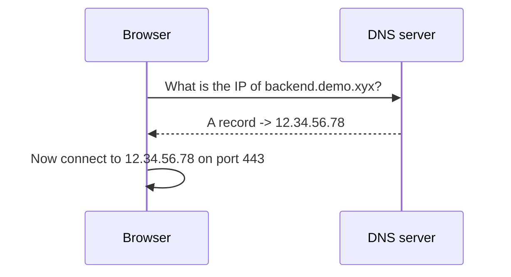

# 07 — DNS, Domains, and Subdomains

> **Goal:** Understand how a name like `backend.demo.xyx` becomes an IP address — the step right after you type a URL (Video 3 spends real time here).

---

## Plain definition

- **Domain name**: a human-friendly address like `google.com` (easier to remember than `142.250.72.14`).
- **DNS** (Domain Name System): the internet's **phonebook**. It translates domain names → IP addresses.
- **Subdomain**: a prefix before the main domain, e.g., `backend.demo.xyx` — here `backend` is the subdomain of `demo.xyx`.
- **DNS record**: an entry in the phonebook. The two you'll meet:
  - **A record**: maps a name → an IPv4 address.
  - **CNAME record**: maps a name → *another name* (an alias).

---

## The phonebook analogy

You know someone's **name** (domain), but to call them you need their **number** (IP). DNS is the phonebook that looks up the number.

```
You type:  backend.demo.xyx
DNS says:  that name = 12.34.56.78   (an A record)
Your browser then connects to 12.34.56.78
```

---

## What happens when you press Enter



This is the **first hop** in Video 3's request journey: Browser → DNS → IP → AWS.

---

## Domains and subdomains, visualized

A domain has parts separated by dots, read right-to-left by importance:

```
backend  .  demo  .  xyx
  │          │        │
subdomain  domain    TLD (top-level)
```

You can have *many* subdomains pointing to *different servers* or *different apps on the same server*:
- `frontend.demo.xyx` → the frontend app
- `backend.demo.xyx` → the backend app

In Video 3, both subdomains point to the **same EC2 IP**, and Nginx (file 10) decides which app handles each based on the subdomain.

---

## A record vs CNAME (simple)

| Record | Maps name to… | Example |
|--------|---------------|---------|
| **A** | An IP address | `backend.demo.xyx → 12.34.56.78` |
| **CNAME** | Another domain name | `www.demo.xyx → demo.xyx` |

Think: **A = direct to number; CNAME = "same as that other name."**

---

## Why this matters for the course

Video 3's request can't even *start* reaching the server without DNS. The domain `backend.demo.xyx` must resolve (via an A record) to the EC2 public IP, or the browser wouldn't know where to send the packets (file 01). DNS is the silent first step of every web request.

---

## Jargon table

| Term | Meaning |
|------|---------|
| Domain name | Human-friendly address (e.g., `google.com`) |
| DNS | The system that maps names → IP addresses |
| IP address | The numeric address computers actually use |
| Subdomain | Prefix before the main domain (`backend` in `backend.demo.xyx`) |
| TLD | Top-level domain (`.com`, `.xyx`) |
| A record | DNS entry: name → IP address |
| CNAME | DNS entry: name → another name (alias) |

---

## Key takeaways

1. **DNS = the internet's phonebook**: name → IP.
2. Typing a URL first triggers a **DNS lookup** (A record → IP).
3. **Subdomains** let one domain host many services (`frontend.`, `backend.`).

---

## Quick check

- You type `app.example.com`. What system turns that into `93.184.216.34`? *(DNS, via an A record)*
- In `shop.example.com`, what is the subdomain? *(shop)*

> Ask me before file 08 (AWS & the cloud).
