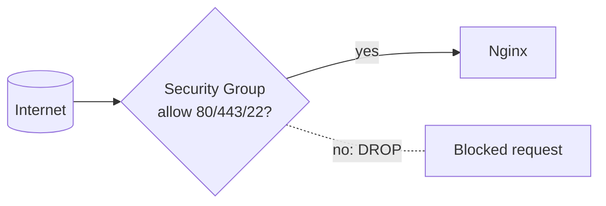

# 09 — Firewalls and Security Groups

> **Goal:** Understand the "firewall" / "security group" step in Video 3's request path — and why your app stays safe.

---

## Plain definition

- **Firewall**: a filter that decides **which network traffic is allowed in or out** of a computer/network. It works mostly by **port** (file 02).
- **Security group**: AWS's name for a firewall attached to your EC2 instance. By default it **blocks everything**; you explicitly *allow* only the ports you need.

Think of a firewall as a **bouncer at a club door** checking IDs and only letting in people on the guest list (allowed ports).

---

## Allow-list thinking (default deny)

A good firewall uses an **allow-list**:
1. Start with: **block all traffic**.
2. Then: **allow** only specific ports.

In Video 3, the security group allows exactly three:
- **22** → SSH (remote login, for the admin)
- **80** → HTTP
- **443** → HTTPS

Everything else (including the app's own port **3001**) is **blocked from the internet**. That's why strangers can't reach `:3001` directly — the firewall drops it (this was the question I asked you earlier!).

---

## Where the firewall sits in the path

A request to port 3001 arrives at the EC2's public IP, hits the security group, and is **dropped** because 3001 isn't on the allow-list. Only 80/443 pass through to Nginx.

---

## Why this matters (security)

Without a firewall, *every* open port on your server is exposed to the entire internet — including admin ports and debugging tools. Attackers scan the internet for such openings. The security group is your first line of defense.

---

## Local vs cloud firewalls

- On your laptop, the OS may have a firewall too (often "off" for home use).
- In the cloud (AWS), the **security group** is the standard firewall and is *on by default* (block all until you allow).

---

## Jargon table

| Term | Meaning |
|------|---------|
| Firewall | A filter allowing/blocking network traffic |
| Security group | AWS's firewall for an EC2 instance |
| Allow-list | Only listed ports are permitted (default deny) |
| Default deny | Block everything unless explicitly allowed |
| DROP | Silently discard a disallowed packet |

---

## Key takeaways

1. A **firewall/security group** allows only specific **ports**; all else is blocked.
2. Video 3 allows **80, 443, 22** — *not* 3001 — so the app isn't directly reachable.
3. This is the answer to the earlier question: a hacker hitting `:3001` directly is **blocked by the security group**.

---

## Quick check

- Default firewall behavior is "allow all" or "block all"? *(block all — default deny)*
- Why can't a stranger reach the app on port 3001? *(security group only allows 80/443/22; 3001 is dropped)*

> Ask me before file 10 (reverse proxy & Nginx).
