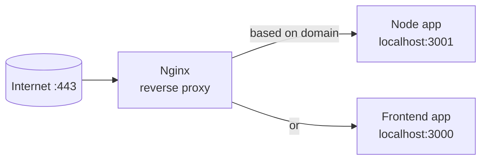

# 10 — Reverse Proxy and Nginx

> **Goal:** Understand the "Nginx reverse proxy" sitting in front of the app in Video 3.

---

## Plain definition

- **Proxy**: a "middleman" that forwards traffic.
- **Reverse proxy**: a server that sits **in front of your app servers** and forwards incoming requests to them. Clients only talk to the reverse proxy; they don't know which app answered.
- **Nginx** (pronounced "engine-x"): the most popular reverse proxy / web server.

In Video 3, **Nginx** listens on ports 80/443 and forwards requests to the Node app on `localhost:3001`.

---

## The receptionist analogy

A reverse proxy is like a **company receptionist**:
- Visitors (requests) arrive at the front desk (Nginx on port 443).
- The receptionist checks the name/domain and sends the visitor to the right office (the app on `:3001`).
- Visitors never know the internal office numbers.

---

## What Nginx does in Video 3



- Listens on **80** → redirects to **443** (HTTPS).
- Listens for the domain `backend.demo.xyx` → forwards to `localhost:3001`.
- Listens for `frontend.demo.xyx` → forwards to `localhost:3000`.

So **one public face** (Nginx) routes to **many internal apps** by domain name.

---

## Why use a reverse proxy? (the reasons)

1. **Central TLS/HTTPS**: Nginx handles encryption once, so each app doesn't have to.
2. **Routing**: one IP/domain can serve many apps.
3. **Hiding internals**: apps stay on `localhost`, shielded from the internet (file 02, 09).
4. **Static files & performance**: Nginx is very fast at serving images/CSS.

---

## Minimal config (just to see the shape)

```nginx
server {
    listen 443 ssl;
    server_name backend.demo.xyx;   # which domain
    location / {
        proxy_pass http://localhost:3001;   # where to forward
    }
}
```

You don't need to understand every line — just see the pattern: **domain → forward to localhost:port**.

---

## Forward vs Reverse (a common mix-up)

| | Sits in front of… | Used by… |
|--|-------------------|----------|
| **Forward proxy** | Clients (hides who you are) | Corporate networks |
| **Reverse proxy** | Servers (hides server topology) | Websites (Nginx) |

Video 3 uses a **reverse** proxy (in front of servers).

---

## Jargon table

| Term | Meaning |
|------|---------|
| Proxy | A middleman that forwards traffic |
| Reverse proxy | Sits in front of app servers, forwards to them |
| Nginx | Popular reverse proxy / web server |
| `proxy_pass` | Nginx directive: "forward to this address" |
| TLS termination | Where encryption is decrypted (here, Nginx) |

---

## Key takeaways

1. A **reverse proxy** (Nginx) sits in front of your apps and forwards requests.
2. It gives **one public face** (port 443) for many internal apps.
3. Video 3's Nginx routes `backend.demo.xyx` → `localhost:3001`.

---

## Quick check

- A user connects to Nginx, not directly to the app. True or false? *(True — that's the point of a reverse proxy.)*
- What does Nginx do with a request to `backend.demo.xyx`? *(forwards it to localhost:3001)*

> Ask me before file 11 (HTTPS / TLS).
