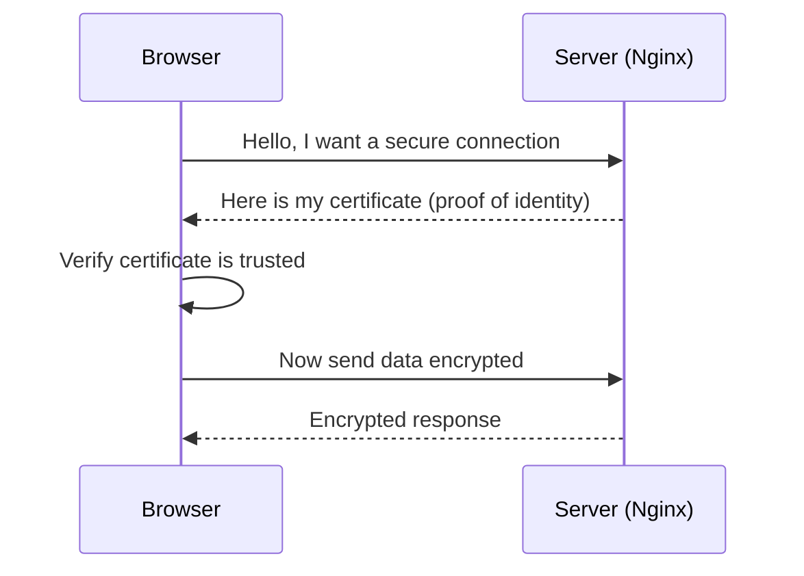

# 11 — HTTPS, SSL/TLS, and certbot

> **Goal:** Understand "HTTPS," "SSL/TLS," and "certbot" from Video 3 — why the padlock exists and what it protects.

---

## Plain definition

- **HTTP**: the web protocol (file 06) — but **plain text**. Anyone between you and the server can read it.
- **HTTPS**: HTTP **plus encryption**. The "S" = Secure.
- **SSL / TLS**: the encryption technology that makes HTTPS secure. (SSL is old; TLS is the modern version, but people still say "SSL".)
- **Certificate**: a digital file proving "this server really is who it claims." Like an ID card for a website.
- **certbot / Let's Encrypt**: a free service/tools that **automatically create and renew** certificates, so you don't pay or do it by hand.

---

## The envelope analogy

- **HTTP** = sending a postcard: anyone who handles it can read it.
- **HTTPS** = sending a locked box: only the recipient has the key to open it.

Encryption means: even if someone taps the wire, they see gibberish, not your password or data.

---

## How it works (simplified)

1. Browser asks for a secure connection.
2. Server shows its **certificate** (proof).
3. Browser verifies it (via a trusted authority).
4. They exchange data **encrypted**.

---

## Ports again

- **80** = HTTP (plain).
- **443** = HTTPS (encrypted).

Modern sites listen on 80 only to **redirect** you to 443. Video 3's Nginx redirects `:80 → :443`.

---

## What certbot does

Getting a certificate used to be expensive and manual. **Let's Encrypt** gives them **free**, and **certbot** automates:
- Requesting the certificate.
- Proving you own the domain.
- Installing it in Nginx.
- **Renewing** it automatically before it expires.

So Video 3's "using certbot to assign SSL certificates automatically" = free, auto-renewing HTTPS, no manual work.

---

## Why this matters

Without HTTPS, passwords, cookies, and personal data travel in plain text — trivially stealable on public Wi-Fi. Every serious backend uses HTTPS. It's also required for many browser features (like secure cookies and some APIs).

---

## Jargon table

| Term | Meaning |
|------|---------|
| HTTP | Web protocol, plain text |
| HTTPS | HTTP + encryption (secure) |
| TLS / SSL | The encryption tech behind HTTPS |
| Certificate | Digital ID proving a server's identity |
| Let's Encrypt | Free certificate authority |
| certbot | Tool that auto-issues/renews certificates |
| Port 80 / 443 | HTTP / HTTPS ports |

---

## Key takeaways

1. **HTTPS = encrypted HTTP**; the "S" keeps data private.
2. A **certificate** proves the server's identity; **TLS** does the encrypting.
3. **certbot** auto-creates & renews free certificates (Let's Encrypt).

---

## Quick check

- What's the danger of HTTP (no S)? *(data travels in plain text, readable by attackers)*
- Which port is encrypted web traffic? *(443)*

> Ask me before file 12 (databases, drivers, pools).
