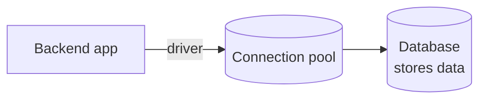
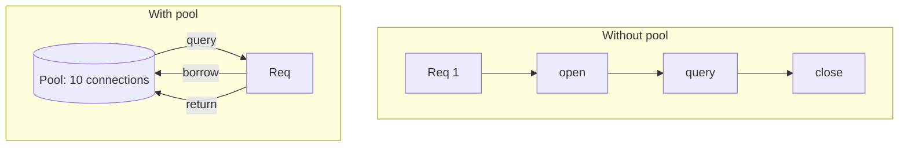

# 12 — Databases, Drivers, and Connection Pools

> **Goal:** Understand the "database," "native driver," and "connection pool" ideas Video 3 uses to explain why the browser can't be the backend.

---

## Plain definition

- **Database**: a program that **stores data** durably (survives restarts) and lets you query it. Think of it as a very smart, organized filing cabinet.
- **Table**: data organized in rows & columns (like a spreadsheet). Example: a `users` table with columns `id, name, email`.
- **SQL**: the language used to ask a database questions ("select all users where age > 20").
- **Driver**: code that lets your *program* talk to the database. (e.g., `pg` for Postgres in Node; the MongoDB driver in Go/JS.)
- **Connection**: an open line between your app and the database.
- **Connection pool**: a reusable set of open connections, so you don't open/close one per request.

---

## The filing-cabinet analogy

| Database concept | Real-world equivalent |
|-----------------|----------------------|
| Database | A filing room |
| Table | One cabinet of folders |
| Row | One folder (one user) |
| Query (SQL) | "Find all folders with 'active' tag" |
| Driver | The clerk who fetches folders for you |
| Connection | The clerk being available to help |
| Pool | Several clerks on standby, reused |

---

## Why a backend needs a database

Video 3's one-word summary of backends was **DATA**. The backend **persists** data — your likes, accounts, posts — so it survives and is shared across all users. That storage is the database.

---

## What is a "native driver"?

A driver is the **translator** between your code (JavaScript/Go) and the database's protocol. "Native" means it's written to run efficiently in that language/runtime. Video 3 says servers have native drivers (e.g., `pg` for Postgres) that handle:
- **socket connections** (the network line to the DB),
- **binary data**,
- **persistent connections** (kept open and reused).

Browsers **don't** have these for databases — so they can't talk to a DB directly.

---

## Connection pooling (the key efficiency idea)

Opening a connection to a database is **slow** (network handshake + auth). A busy backend gets **thousands of requests per second**. If it opened and closed a connection *for every request*, the database would be overwhelmed.

A **pool** keeps, say, 10 connections warm. Each request **borrows** one, runs its query, and **returns** it.

**Why browsers can't do this:** even if a browser *could* connect to a DB, every user would open their *own* connection → the DB drowns in connections. The backend centralizes and pools instead.

---

## Why the browser can't be the backend (DB angle)

1. No native DB drivers in the browser.
2. No way to keep persistent, pooled connections.
3. If it could, each user opening their own DB connection would overwhelm the database.
4. (Plus the security/sandbox/CORS reasons from file 13.)

---

## Jargon table

| Term | Meaning |
|------|---------|
| Database | Durable storage you can query |
| Table / Row | Like a spreadsheet / one record |
| SQL | The query language for many databases |
| Driver | Code translating your app ↔ database |
| Connection | An open line to the database |
| Connection pool | Reusable set of open connections |
| Postgres | A popular free relational database |

---

## Key takeaways

1. A **database** durably stores the backend's data.
2. A **driver** lets your code talk to the DB; servers have native ones, browsers don't.
3. A **connection pool** reuses connections for speed and to protect the DB.

---

## Quick check

- What problem does a connection pool solve? *(avoid opening/closing a DB connection per request, which would overwhelm the DB)*
- Can your browser use a Postgres driver directly? *(No — browsers lack native DB drivers and pooling)*

> Ask me before the final file, 13 (browser sandbox, CORS, hydration).
