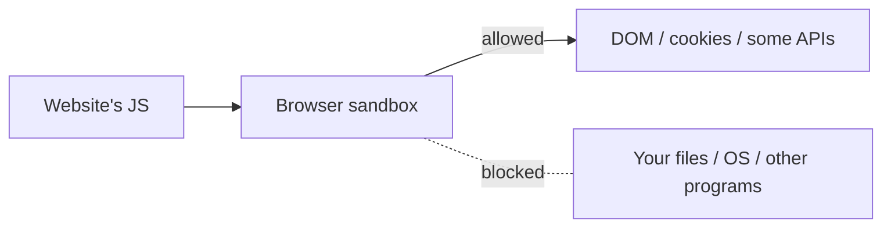
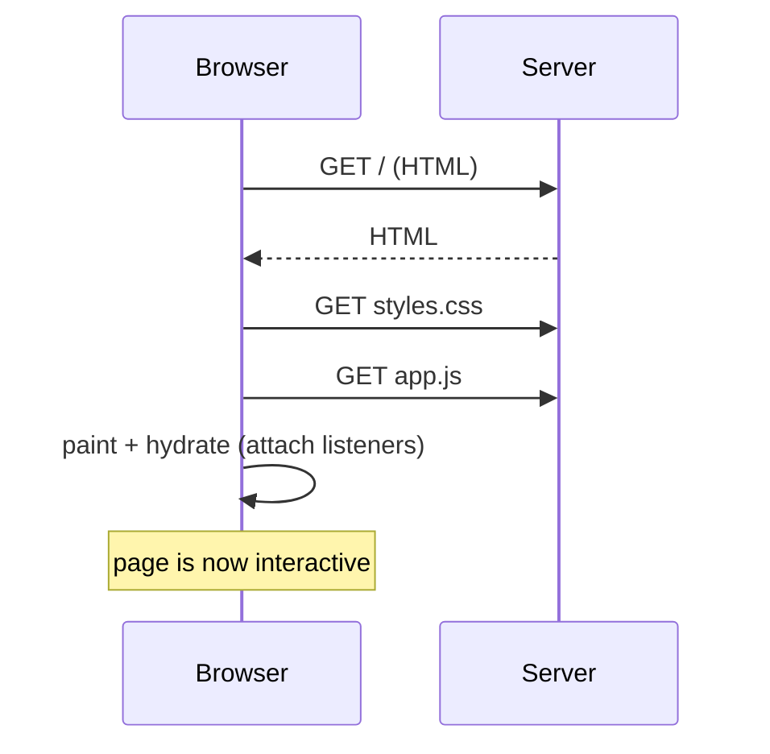
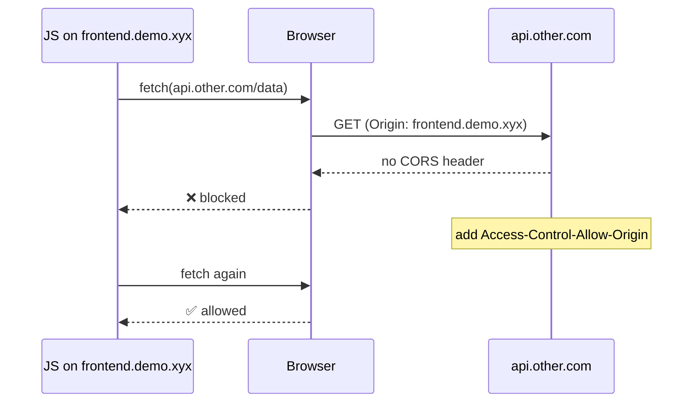

# 13 — Browser Runtime, Sandbox, CORS, and Hydration

> **Goal:** Understand the *frontend-side* reasons Video 3 gives for why backend logic can't live in the browser.

---

## Plain definition

- **Browser runtime**: the browser is the *environment* that runs your frontend JavaScript (just like Node is the runtime for backend JS — file 04/05).
- **Sandbox**: the browser runs JS in an **isolated, restricted box**. The JS *cannot* freely access your filesystem, other programs, or OS — only what the browser explicitly allows (the page DOM, some storage, certain APIs).
- **DOM (Document Object Model)**: the browser's live representation of the page; JS can read/change what's on screen via the DOM.
- **CORS (Cross-Origin Resource Sharing)**: a browser **security policy** that blocks a page's JS from *reading responses* from a different **origin** (scheme + host + port, not just domain) unless that server permits it via `Access-Control-Allow-*` headers. Precise point: for "simple" requests the browser still *sends* the request and the server still *processes* it — CORS blocks your JavaScript from *reading the response*, it does not stop the request. (The sequence diagram below shows exactly this.)
- **Hydration**: when a page's downloaded JavaScript "wires up" interactivity — attaching click handlers so buttons actually work.

---

## The sandbox analogy

Imagine visiting a stranger's website. The browser **downloads and runs their code (JS)** on *your* machine. If that code had full access, it could read your files, steal passwords, and send them away. So the browser puts the code in a **sandbox** — it can paint the page and react to clicks, but **cannot** touch your files or other apps. This is a *feature*, not a bug.



---

## How the frontend actually runs (Video 3 demo)

When you load a page:

1. Browser fetches **HTML** (the structure).
2. Browser fetches **CSS** → paints colors/layout.
3. Browser fetches **JavaScript** → **hydrates**: attaches event listeners (clicks, inputs).
4. Now the page is interactive. Any further data comes from **fetching the backend** via HTTP (file 06).



Key point: the JS runs **in your browser** (the browser is the runtime). The backend, by contrast, runs processing **on the server**.

---

## CORS — why cross-domain calls get blocked

Your frontend at `frontend.demo.xyx` wants to call an API at `api.other.com`. The browser **blocks** it unless `api.other.com` sends a permission header:

```
Access-Control-Allow-Origin: https://frontend.demo.xyx
```



**Why it matters:** a backend often *needs* to call many external services freely. Browsers can't (CORS). So that logic must live on the server.

> Note: CORS is **enforced by the browser**, not the network. A backend calling another backend faces no such restriction.

---

## The four reasons, summarized (from Video 3)

| # | Reason browser can't be the backend | Foundation file |
|---|--------------------------------------|-----------------|
| 1 | **Security / sandbox** — no filesystem/OS access | this file |
| 2 | **CORS** — can't freely call other domains | this file |
| 3 | **No DB drivers / pooling** — can't talk to DB efficiently | file 12 |
| 4 | **Weak/variable compute** — runs on the user's device | file 03/08 |

---

## Jargon table

| Term | Meaning |
|------|---------|
| Browser runtime | The browser environment that runs frontend JS |
| Sandbox | Isolated, restricted space where page JS runs |
| DOM | The browser's live page model JS can manipulate |
| CORS | Browser policy restricting cross-domain JS calls |
| Hydration | JS attaching interactivity after page load |
| Origin | The scheme+domain+port of a page (e.g., `https://frontend.demo.xyx`) |

---

## Key takeaways

1. The **browser is a sandboxed runtime** — safe, but restricted.
2. **CORS** blocks cross-domain calls unless permitted by headers.
3. Frontend JS runs **in the browser**; backend logic runs **on the server** — that split is why we need backends.

---

## Quick check

- Why does the browser sandbox JS? *(so malicious sites can't read your files / access your OS)*
- A browser blocks your fetch to another domain. What header fixes it? *(Access-Control-Allow-Origin)*

---

## 🎉 You're done with the foundations!

You now understand every building block Video 3 assumes:
internet/IP → client/server/port → frontend vs backend → code/runtime → Node server → HTTP → DNS → AWS/EC2 → firewall → Nginx → HTTPS → databases → browser sandbox/CORS.

**Next step:** Read `notes/03-what-is-backend.md` (Video 3 notes). It will now read like a summary of what you've learned — and `3.1-deepening.md` and `3_questions.md` will make sense.

Then come back and **ask me any question** — about anything that's still fuzzy. We don't watch Video 4 until you're comfortable here.
