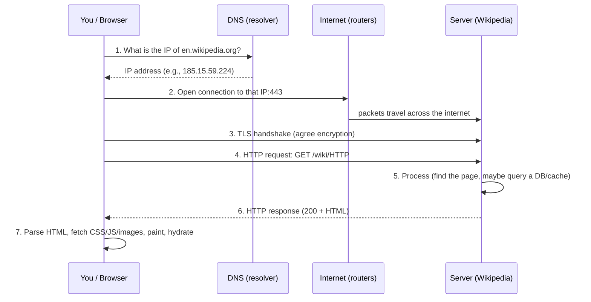
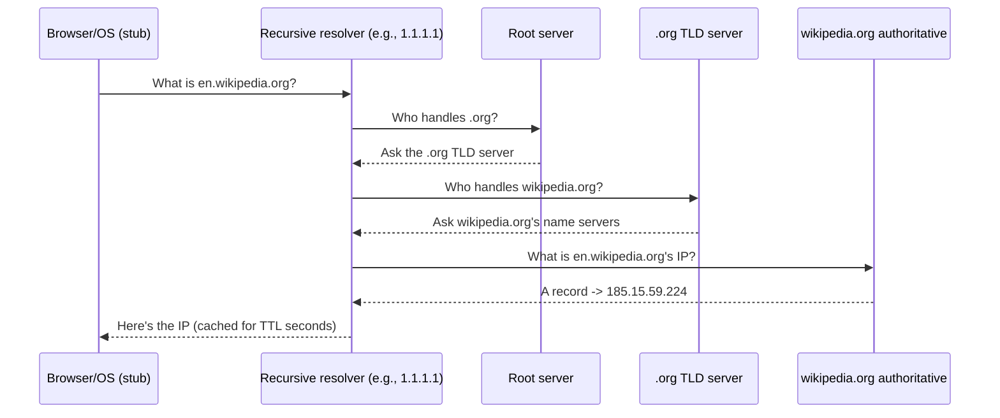
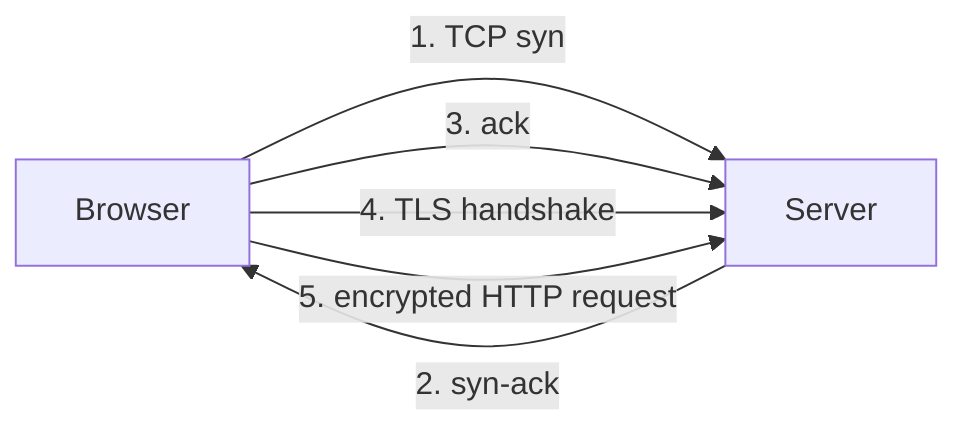

# How the Internet Actually Flows + Reading the Browser Network Tab
### A beginner deep-dive to build the "systems intuition" Sriniously has

> **Why this document exists:** In Video 3, Sriniously traces a request from browser → DNS → AWS → firewall → Nginx → server like it's second nature. That ease comes from **networking intuition** most self-taught beginners don't have yet. This file builds that intuition from zero: what really happens when you load a page, the words that describe it, and — most importantly — **how to *see* it yourself** in your browser's Network tab.
>
> **Companion files:** `foundations/01-internet-networks-ip.md` … `13-browser-sandbox-cors.md`. This is the "put it all together + look at it live" capstone of the foundations series.
>
> **Examples used here (different from the video):** loading a **Wikipedia article**, doing a **Google search**, and running **your own local server** from `foundations/05`.

---

## 0. The one idea to hold onto

> **The internet is a postal system for computers.** Your browser writes a "letter" (a request), puts an address on it (a domain → IP), and the letter is carried across many sorting offices (routers) to a "post office" (server) that reads it, does work, and sends a reply (a response) back.

Every weird term below (packet, port, DNS, TCP, TLS, HTTP, proxy, cache) is just a part of that postal system. Learn the parts, and you'll "see the flow" too.

---

## 1. The full journey: what happens when you type a URL

Let's say you type `https://en.wikipedia.org/wiki/HTTP` and press Enter. Here is the real sequence:



Now each step, in plain words:

1. **DNS lookup** — turn the name into an IP (Section 2).
2. **Open a connection** — the browser asks the operating system to open a pipe to that IP on port 443.
3. **TLS handshake** — because it's HTTPS, the browser and server agree on an encryption key (Section 3).
4. **HTTP request** — the actual "give me this page" message (foundations/06).
5. **Server processing** — the server's app decides what to send back (this is where backends live; foundations/03, 05, 12).
6. **HTTP response** — status + headers + body come back.
7. **Browser rendering** — the browser reads the HTML, then makes *more* requests for CSS, JS, images, fonts (each is its own mini version of steps 1–6!).

> 🔑 The big "aha": loading **one page** usually fires **dozens of requests**. The Network tab (Section 4) shows them all.

---

## 2. DNS — the phonebook step, in detail

Your browser does **not** know where `en.wikipedia.org` lives. It only knows the *name*. DNS finds the *address*.

### The chain (who asks whom)



Real-world facts (verified against current DNS docs):
- Your laptop talks **only** to a **recursive resolver** (your ISP's, or a public one like Cloudflare `1.1.1.1` or Google `8.8.8.8`). *You never talk to root/TLD servers directly* — the resolver does the legwork.
- There are **13 logical root server identities** (A–M), each anycast to hundreds of physical servers worldwide.
- The chain is **root → TLD (.org) → authoritative (wikipedia.org)**. Each step returns a *referral* until the authoritative server gives the final **A record** (name → IPv4).
- Answers are **cached** at every level (browser → OS → resolver) for a time called **TTL**. A cached lookup is <1 ms; a cold lookup is ~20–120 ms. That's why the second visit to a site feels instant.

> 💡 You can watch this chain yourself with a terminal command (optional): `dig +trace en.wikipedia.org`. Each "block" is one step of the walk above.

---

## 3. Connecting & securing: TCP and TLS (simple version)

- **TCP** is the "reliable delivery" protocol. Before any data, the browser and server do a **3-way handshake** (syn → syn-ack → ack) to confirm both sides are listening. Think of it as "knock knock / who's there / it's me" before the conversation.
- **TLS** (the S in HTTPS) then negotiates encryption on top of that TCP connection, so the actual request/response is unreadable to eavesdroppers.
- **Port**: TCP connects to a specific *door* on the server. `443` = HTTPS, `80` = HTTP (foundations/02, 09).



This is exactly the **"Initial connection"** and **"SSL"** phases you'll see in the DevTools Timing tab (Section 4).

---

## 4. Hands-on: Open Chrome DevTools → Network tab (real walkthrough)

This is the skill Sriniously uses when he says *"open the network toolbar and disable cache."* Let's do it with **Wikipedia**, not his demo.

### Step 1 — Open DevTools
- **Windows/Linux:** press `F12` (or `Ctrl + Shift + I`).
- **macOS:** `Cmd + Option + I`.
- A panel appears (usually docked to the right or bottom).

### Step 2 — Go to the Network panel
- In the DevTools top bar, click **Network**. (If you don't see it, press `F1`/the `⋮` menu → *Show Network panel*, or just type "Network" in the Command Menu with `Ctrl/Cmd + Shift + P`.)

### Step 3 — Turn ON "Disable cache"
- In the Network panel's toolbar (top), find the **"Disable cache"** checkbox and check it.
- ⚠️ **Important:** this only takes effect **while DevTools is open**. The moment you close DevTools, normal caching resumes.
- **Why Sriniously does this:** with caching on, a repeat visit may show `200 (from disk cache)` or `304 Not Modified` instead of a real network fetch. Disabling cache guarantees you see the *true* request/response — the "appropriate status code" he mentioned.

### Step 4 — Load the page
- In the address bar, go to `https://en.wikipedia.org/wiki/Hypertext_Transfer_Protocol`.
- Watch the Requests table fill up with rows — one per request.

### Step 5 — Read the Requests table (the columns)

| Column | What it tells you |
|--------|-------------------|
| **Name** | The file/URL requested (the main document, a CSS file, an image…) |
| **Status** | HTTP status (200 = ok, 301/302 = redirect, 404 = missing, 500 = server error) |
| **Type** | Kind of resource (`document`, `stylesheet`, `script`, `image`, `fetch`/`xhr`, `font`…) |
| **Initiator** | What *caused* this request (e.g., the HTML parsing, or a script) |
| **Size** | How big the response was (and if it came from cache) |
| **Time** | Total time for that request |
| **Waterfall** | A visual timeline of when it started/ended and which phase dominated |

> You'll typically see **one `document`** (the HTML) plus many `stylesheet`, `script`, `image`, `font` requests — because the HTML references them and the browser fetches each.

### Step 6 — Click a request → inspect the tabs
Click the **top document** row (the one named like `Hypertext_Transfer_Protocol`). A detail pane opens on the right with tabs:

- **Headers** — the HTTP request & response headers (goldmine; see Section 5).
- **Payload** — the data sent *with* the request (query params, form data).
- **Preview** — a rendered-ish view of the response.
- **Response** — the raw response body (the HTML source here).
- **Initiator** — the call stack that triggered it.
- **Timing** — the phase-by-phase breakdown (Section 6).
- **Cookies** — any cookies sent/received.

### Step 7 — Filter (optional but useful)
The filter box above the table lets you show only, say, `css` or `img` or `fetch/xhr`. Try typing `img` — you'll see only image requests.

---

## 5. Read a real request, line by line

Here's a realistic **request** your browser sends for that Wikipedia page, and the **response** it gets. I've annotated the important parts.

**Request (what your browser sends):**
```
GET /wiki/HTTP HTTPS/1.1
Host: en.wikipedia.org
User-Agent: Mozilla/5.0 (Macintosh; Intel Mac OS X 10_15_7) AppleWebKit/537.36 Chrome/126 Safari/537.36
Accept: text/html,application/xhtml+xml
Accept-Language: en-US,en;q=0.9
Connection: keep-alive
```
- `GET` = fetch (foundations/06). `/wiki/HTTP` = the path. `HTTPS/1.1` = protocol version.
- `Host` = which site (a server can host many domains).
- `User-Agent` = "who is asking" (your browser/OS).
- `Accept-Language` = "I prefer English."

**Response (what the server sends back):**
```
HTTP/1.1 200 OK
Content-Type: text/html; charset=UTF-8
Content-Length: 123456
Server: mw-frontend
Cache-Control: max-age=3600
Set-Cookie: WMF-Last-Access=...; path=/; expires=...
```
- `200 OK` = success.
- `Content-Type: text/html` = "the body is an HTML page" (if this said `application/json` you'd know it was data, not a page).
- `Cache-Control: max-age=3600` = "ok to cache this for 1 hour" (this is what "Disable cache" overrides).
- `Set-Cookie` = the server asking the browser to remember something for next time.

> 🔎 **Try it:** click the **Headers** tab for the document request in your own DevTools. You'll see exactly these fields (values differ). Reading them stops HTTP from being mysterious.

---

## 6. The Timing tab — see the "flow" as a timeline

Click any request → **Timing** tab. You'll see colored bars for each phase. These map *directly* to the journey in Section 1:

| Phase (DevTools) | Plain meaning | Maps to |
|------------------|---------------|---------|
| **Queueing** | Browser waiting its turn (priority, or 6-connection limit per domain on HTTP/1.1) | — |
| **Stalled** | Brief delay before send (same causes as Queueing) | — |
| **DNS Lookup** | Resolving the domain → IP | Section 2 |
| **Initial connection** | TCP handshake | Section 3 |
| **SSL** | TLS handshake (HTTPS only) | Section 3 |
| **Request sent** | Uploading your request (usually <1 ms) | Step 4 in §1 |
| **Waiting (TTFB)** | Time to **first byte** of response = network round-trip + server think time | Steps 5–6 in §1 |
| **Content Download** | Receiving the response body | Step 6 in §1 |

Color key (from Chrome's own docs): DNS = teal, Connection/SSL = orange, Request sent/TTFB = green, Download = blue.

> 💡 **Diagnostic power:** if a page is slow, the Timing tab tells you *why*. Long **TTFB** = the *server* is slow. Long **Content Download** = the *response is huge* (fix compression/payload). Long **DNS/SSL** = connection overhead (matters most on first load).

---

## 7. Bridge example: watch YOUR OWN server in the Network tab

Remember `foundations/05` where you ran a 10-line Node server on `localhost:3001`? Now **see it in the Network tab** — this proves the whole flow on your own machine, no AWS needed.

1. Run `node hello-server.js` (it listens on `localhost:3001`).
2. Open DevTools → Network → check **Disable cache**.
3. Visit `http://localhost:3001`.
4. You'll see **exactly one request**. Click it:
   - **Timing** shows almost no DNS Lookup (localhost is hardcoded to `127.0.0.1` — no real DNS query) and a tiny TTFB.
   - **Response** shows your `"Hello! You reached the backend."` text.

```mermaid
flowchart LR
    B[Browser] -->|GET localhost:3001\n(no DNS: 127.0.0.1)| APP[Your Node server\n:3001]
    APP -->|200 + text| B
```

This tiny experiment is the same request path Video 3 traces across AWS — just collapsed onto one laptop. **That's the intuition:** a "server" is just a program listening for requests; the rest (DNS, cloud, proxies) is plumbing around it.

---

## 8. Second real example: a Google search

You mentioned the "Google console network tab" — here's that exact scenario:

1. Open DevTools → Network → Disable cache.
2. Go to `https://www.google.com` and search `how does the internet work`.
3. The Requests table fills. The **first** row is the `document` (the results page HTML).
4. As you type, Google fires **`fetch`/`xhr`** requests (type column) to an autocomplete API — those are the live suggestions. This shows **dynamic requests** the page makes *after* loading, not just the initial document.
5. Click a `fetch`/xhr row → **Preview** often shows JSON (the suggestions). This is a frontend (browser) talking to a backend (Google's API) via HTTP — exactly the frontend↔backend split from foundations/03.

> The takeaway: the Network tab reveals **two kinds of requests** — the page itself, and the behind-the-scenes API calls modern apps make constantly.

---

## 9. Common misconceptions (clear these up)

- ❌ "The internet is one big wire." → ✅ It's millions of interconnected networks; your data hops through many routers.
- ❌ "DNS happens every single time." → ✅ Usually cached; only a cold lookup walks the full root→TLD→auth chain.
- ❌ "HTTPS slows things down a lot." → ✅ The TLS handshake adds ~tens of ms once; then it's negligible and you get security.
- ❌ "Disable cache stays on forever." → ✅ Only while DevTools is open.
- ❌ "Port 3001 is publicly reachable." → ✅ Only if a firewall/security group allows it (foundations/09). On `localhost` it's not.
- ❌ "One page = one request." → ✅ One page = many requests (HTML + CSS + JS + images…).

---

## 10. Glossary (ties back to foundations files)

| Term | Meaning | See |
|------|---------|-----|
| Packet | A small chunk of a message sent independently | 01 |
| IP address | A computer's address on the internet | 01, 02 |
| Port | A numbered door on a computer (443=HTTPS) | 02, 09 |
| DNS / resolver | Phonebook: name → IP | 07, §2 here |
| A record | DNS entry mapping name → IP | 07 |
| TCP | Reliable connection protocol (handshake) | §3 here |
| TLS / HTTPS | Encryption for HTTP | 11 |
| TTFB | Time To First Byte (server think + latency) | §6 here |
| Cache / Disable cache | Stored responses; off = always refetch | §4 here |
| Request / Response | The two halves of HTTP | 06 |
| Proxy | Middleman that forwards traffic | 10 |

---

## 11. Exercises to build the intuition (do these)

1. **Three-site audit:** Open the Network tab (Disable cache on) for `wikipedia.org`, `google.com`, and any shop site. Note: how many requests? biggest file? slowest request (sort by Time)?
2. **Watch DNS vanish:** Load a site twice. First load shows a `DNS Lookup` slice in Timing; second load (still cold cache) may be shorter because the OS resolver cached it.
3. **Local server:** Run `hello-server.js`, load `localhost:3001`, confirm one request with near-zero DNS.
4. **Slow it down:** In the Network toolbar, set throttling to **Slow 3G** and reload. Watch TTFB and Download balloon — now you *feel* latency and payload size.
5. **(Optional, advanced):** Run `dig +trace en.wikipedia.org` in a terminal to see the DNS walk printed step by step.

---

## 12. You now have the intuition

When Sriniously says in Video 3 *"the request starts from the browser, goes to our DNS server, then to our AWS instance, through a firewall, to Nginx, then to localhost:3001,"* you can now mentally expand every word:

- **"goes to our DNS server"** → the recursive-resolver chain (§2).
- **"AWS instance"** → a rented computer with a public IP (foundations/08).
- **"through a firewall"** → only ports 80/443/22 allowed (foundations/09).
- **"to Nginx"** → reverse proxy forwarding by domain (foundations/10).
- **"localhost:3001"** → the Node app listening on a local port (foundations/05).
- And every hop is visible to you in the **Network tab** you just learned (§4–§6).

That's the "systems view" — you've got it now. Go back and read `notes/03-what-is-backend.md`; it should read like a recap. Then ask me anything that's still fuzzy.

---

## 13. Senior lens — read the Network tab like a security reviewer

Once the flow is boring, the Network tab becomes a **recon surface**. Every row is an endpoint talking to some server — each one is potential attack surface. A senior engineer doesn't just ask "did it load?" but "what did this conversation leak?" Here's what to click for:

### 13.1 Response headers — the security posture, in plain sight
Click any request → **Headers** → **Response Headers**. These tell you how hardened the site is:

| Header | What a hacker checks | Red flag (loose) | Tight setting |
|--------|----------------------|------------------|---------------|
| `Strict-Transport-Security` (HSTS) | Is the site stuck to HTTPS? | Missing → SSL-strip downgrade possible | `max-age=63072000; includeSubDomains; preload` |
| `Content-Security-Policy` | What can load & run? | Missing / `default-src *` → XSS runs anything | `default-src 'self'` + explicit allowlist |
| `X-Frame-Options` / `frame-ancestors` | Clickjacking defense | Missing → site can be framed | `DENY` / `SAMEORIGIN` |
| `X-Content-Type-Options` | MIME sniffing | Missing → upload filter bypass | `nosniff` |
| `Referrer-Policy` | Where your URL leaks | `unsafe-url` → full path+query sent to 3rd parties | `strict-origin-when-cross-origin` |
| `Access-Control-Allow-Origin` | CORS trust | `*` **with** `Access-Control-Allow-Credentials: true` → any site can call API as you | Specific origin, never `*` + credentials |

> 🔎 **Visualize it:** load a bank/login site and check its Response Headers. Most big sites show all of the above. Then load a random small app — you'll often see *none* of them. That gap is the difference between "hardened" and "easy target."

### 13.2 Cookie flags — the session-theft dial
Click a request → **Cookies** (or look at `Set-Cookie` in Response Headers). Three flags decide whether your login can be stolen:

- **`Secure`** — cookie only sent over HTTPS. Missing = sent over plaintext HTTP, sniffable on Wi-Fi.
- **`HttpOnly`** — JS can't read it. Missing = any XSS bug hands the session token to attacker JS.
- **`SameSite`** — `Strict`/`Lax` blocks CSRF; `None` (without care) lets cross-site requests carry it.

> A session cookie that is **not** `HttpOnly` + `Secure` is the single most common "oops" a senior flags in review.

### 13.3 Mixed content & secrets in the URL
- **Mixed content:** an `https://` page pulling a subresource over `http://` shows up as a red "blocked" row (and a console warning). That `http` request is unencrypted and tamperable — a classic MITM pivot.
- **Secrets in the URL:** anything in the query string (`?token=...&key=...`) is visible **right there in the Network tab Name column**, and also lands in browser history, server logs, and `Referer` headers. Never put tokens in URLs — use headers/body.

---

## 14. Hacker drills — see the raw conversation without a browser

The Network tab is a *view* of traffic the browser made. A hacker wants to *make* the traffic by hand, to probe what the server actually accepts. Two terminal tools strip away the browser's politeness:

### 14.1 `curl -v` — watch the handshake + headers yourself
```bash
curl -v https://en.wikipedia.org/wiki/HTTP
```
You'll see, in order: the DNS resolution, the `CONNECT`/TLS handshake, then the raw request line and headers, then the response. It's Section 1's diagram printed line by line — but now *you* control every header. Try:
```bash
curl -v -H "User-Agent: evil-scanner" https://example.com   # spoof UA
curl -v -X POST -d "x=1" https://example.com/api            # hand-craft a POST
curl -i https://example.com                                 # headers only (-I for HEAD)
```
> 💡 If a server behaves differently for a weird `User-Agent` or a `POST` it "shouldn't" accept, that's a hint about missing input validation — exactly what a pen-tester probes.

### 14.2 `openssl s_client` — inspect the certificate & ciphers
```bash
openssl s_client -connect en.wikipedia.org:443 -servername en.wikipedia.org
```
This shows the cert chain, expiry, and the negotiated cipher. As a reviewer you're looking for: expired/self-signed certs, certs valid for the wrong name, and weak/legacy ciphers (anything `RC4`, `DES`, `TLSv1.0/1.1`). Modern = `TLSv1.2/1.3` with AEAD ciphers.

### 14.3 `nmap` — what doors are actually open
```bash
nmap -sV -Pn example.com      # what ports/services answer?
```
Cross-reference with foundations/09: a production box should answer on **only** 80/443 (and 22 from your IP). If `nmap` shows 3306 (MySQL), 6379 (Redis), or 3001 open to the world, that's a leak waiting to happen — tighten the security group / firewall.

---

## 15. Where beginners leave holes (and how a senior tightens them)

A compact map from "what you see in the tab" → "the flaw" → "the fix":

| You observe in Network tab | Likely flaw | How to tighten |
|----------------------------|-------------|----------------|
| No `Set-Cookie` `Secure`/`HttpOnly` | Session theft via sniff / XSS | Set both flags on every auth cookie |
| `Access-Control-Allow-Origin: *` + credentials | Any site calls your API as the user | Pin exact origin; drop credentials or wildcard |
| `http://` subresource on `https` page | MITM / tampering | Serve everything over HTTPS; add HSTS |
| Tokens/keys in the URL query | Logs + history leak | Move to `Authorization` header |
| No CSP / `X-Frame-Options` | XSS runs wide, clickjacking | Add strict CSP, `frame-ancestors 'none'` |
| `nmap` shows DB/cache ports public | Direct DB access from internet | Firewall / security-group to private subnet |
| Plain `http://` to your API | Full request readable on the wire | Terminate TLS; redirect 80→443 |
| No rate limiting (100x 200s fast) | Brute-force / credential stuffing | Add 429 + backoff at the proxy (Nginx/WAF) |

> The mental model: **every request the tab shows is a door; every missing header is a door left unlocked.** Senior work is walking the list and locking each one.

---

*Next: once comfortable, we continue to Video 4 ("Benefits of learning from first principles") and then the big one, Video 5 (HTTP deep-dive), where the Network tab becomes your daily tool.*
