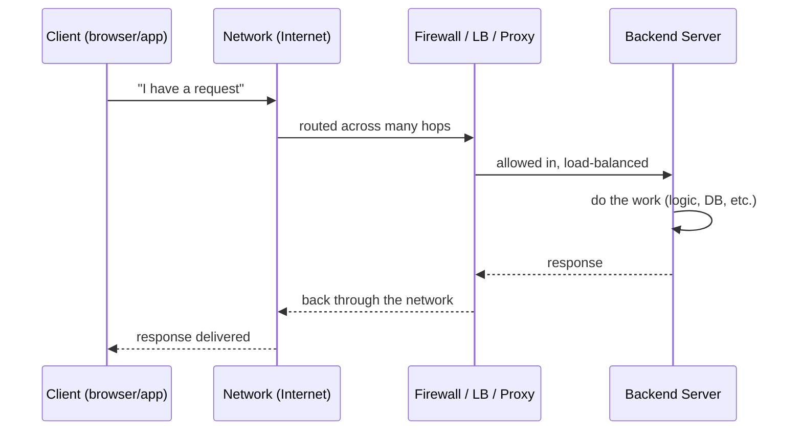
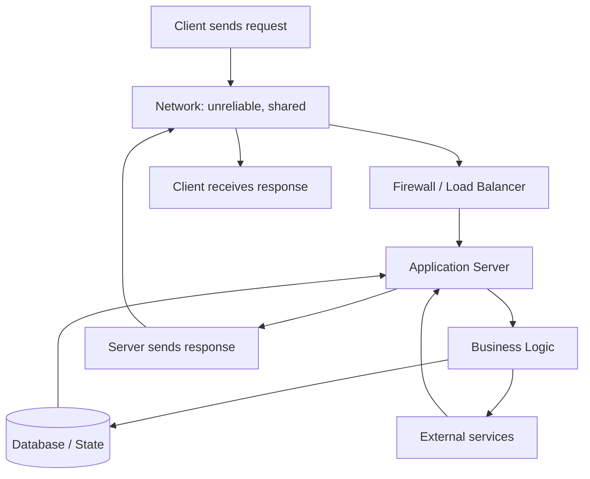

# Topic: What Is a Backend, and How Does a Request Actually Travel?

> **Source:** playlist V1 "Roadmap" · V3 "What is a Backend, how do they work and why do we need them?" · V4 "Benefits of learning backend engineering from first principles" (Sriniously, *Backend from First Principles*)
> **Level:** foundation
> **Prerequisites:** none
> **Status:** done

---

## 1. TL;DR (read this if you read nothing else)

A **backend** is the hidden machinery that receives a request from a client
(browser, app, another service), does protected work (talks to databases,
enforces rules, runs logic), and returns a response. The single most important
mental model: **a request is not magic — it is a packet that physically
hops across many machines and layers**, and every backend concept (HTTP,
routing, auth, databases, caching…) is just *one box or arrow* in that
journey, zoomed in.

Backend engineering is **not** "building CRUD APIs." It is the discipline of
building **reliable, scalable, fault-tolerant, maintainable, and efficient
systems**.

## 2. The Problem This Solves

A web page in your browser cannot, by itself, remember your password, store a
billion photos, charge a credit card, or coordinate with a thousand other
users. The browser is a thin client with limited trust and durability. We need
a **separate, always-on, shared, protected system** elsewhere (a server) that:

- holds state we all agree on (a database),
- enforces who is allowed to do what (auth + rules),
- does heavy or sensitive work the client must not be trusted to do,
- stays available even when individual pieces fail.

That separated system — and the discipline of building it well — is "the
backend." The hard part was never "make a function that returns JSON." The hard
part is doing the above **under load, across failures, for years, with many
people changing the code.**

## 3. First-Principles Mental Model

Strip everything away. Two programs on two different machines want to talk.



The smallest true model has just three moving parts:

1. **A client** that wants something and speaks a known language (a protocol).
2. **A channel** (the network) that may drop, reorder, duplicate, or delay
   messages, and that no single machine controls.
3. **A server** that listens, understands the protocol, does work, and replies.

Everything else in backend engineering is a response to the *failure modes* of
this naive model: the network is unreliable, the server can crash, many clients
arrive at once, untrusted clients lie, and state must survive restarts.



## 4. Core Concepts (language-agnostic)

| Concept | Plain-English Meaning |
|---------|----------------------|
| **Client** | The program asking for something (browser, mobile app, another backend). |
| **Server** | A remote program that listens for requests and sends responses. |
| **Request** | A message from client → server asking for data or an action. |
| **Response** | The message server → client with the result. |
| **Protocol** | The agreed "language" both sides speak (e.g., HTTP). Without it, bytes are noise. |
| **Packet** | The unit of data that actually travels; a message is split into many. |
| **Hop** | One step a packet takes between machines/routers on its path. |
| **Port** | A numbered "door" on a machine; a server listens on a specific port. |
| **Socket** | The OS abstraction for "talking." A *listening* socket is identified by IP + port; an *established* connection is uniquely identified by the full 4-tuple (src IP, src port, dst IP, dst port) — which is why one server IP:port serves thousands of simultaneous connections. |
| **Firewall** | A filter deciding which traffic may enter/leave. |
| **Load balancer / reverse proxy** | A front door that spreads requests across many servers and hides them. |
| **Latency** | Time for one request to make the round trip (ms). |
| **Bandwidth vs throughput** | *Bandwidth* = the link's maximum capacity; *throughput* = the rate actually achieved (always ≤ bandwidth, reduced by protocol overhead, congestion, and loss). |
| **State** | Data the system remembers between requests (DB, cache, session). |
| **Runtime** | The engine executing server code (event loop, thread scheduler, GC). |
| **Framework** | A toolkit that *calls your code* and hides much of the machinery below. |

Key insight: the request does **not** go "straight" to your handler. It passes
through DNS → TCP → TLS → firewall → load balancer → web server → framework →
your code. Each layer can fail, reject, or alter it. (Exact ordering is
environment-dependent — an edge firewall usually sits ahead of the load
balancer at the network perimeter.)

## 5. How It Fits the Request Lifecycle

This topic *is* the lifecycle skeleton. Every other KB file is a zoom-in of one
part:

- **HTTP** (`02-http.md`) = the protocol spoken on the wire.
- **Routing** (`03-routing.md`) = how the server picks *which* code handles a URL.
- **Serialization** (`04-serialization.md`) = how in-memory data becomes wire bytes.
- **Auth** (`05-auth.md`) = proving *who* and *what they may do* at the door.
- **Middleware** (`07-middleware.md`) = reusable code on the path in/out.
- **Handlers** (`09-handlers.md`) = the actual work your code does.
- **Databases** (`11-databases.md`) = where state lives.
- **Caching** (`13-caching.md`) = shortcutting expensive work.
- **Observability** (`19-observability.md`) = seeing this whole path in production.

If you can draw this diagram from memory and point to where each topic plugs
in, you already have the senior-level mental model.

## 6. Beginner Mistakes

- **Treating the network as reliable.** Assuming the request always arrives, in
  order, exactly once. It doesn't — packets drop, connections reset, responses
  time out. Beginners write code that works 99% of the time and explodes at 2am.
- **Thinking the backend is "just the API."** Believing the job is writing
  endpoints, missing that the real work is reliability, state, and failure
  handling.
- **Client = trusted.** Accepting data from the client as true (prices, user
  IDs, roles). The client is adversarial by default.
- **Ignoring the round trip.** Shipping N requests from the browser where one
  would do (N round trips of latency), because they "didn't think about the
  network."
- **"It worked locally, ship it."** Local has one user, no load balancer, no
  real network, no other tenants. Production is a different universe.
- **Confusing the browser and the server.** Not knowing *which side* runs the
  code — e.g., putting secret keys in client-side code.

## 7. Intermediate Mistakes

- **No timeout anywhere.** A hung downstream (DB, 3rd party) silently holds
  connections forever; the whole server exhausts its sockets and stalls. Every
  network call needs a timeout and a cap on concurrency.
- **Treating the server as a single instance.** Forgetting there are often
  *many* server processes behind a load balancer, so in-memory state
  (a variable, a cache) is not shared and disappears on restart. "Works on one
  node, breaks in prod."
- **Synchronous everything.** Doing slow work (email, image processing,
  third-party calls) inline in the request, blocking the response and the
  thread/event-loop. Should often be a **task queue** (`15-queues.md`).
- **No idempotency.** Retried requests (which the network *will* send) cause
  double charges / double inserts because the server can't tell a retry from a
  duplicate.
- **Assuming order and exactly-once.** Building logic that breaks if events
  arrive out of order or twice — which distributed systems guarantee neither by
  default.
- **No observability of the path.** Knowing the endpoint is slow but not
  *where* the time goes (DNS? TLS? LB? DB?). Building blind.
- **Ignoring graceful degradation.** A single failing dependency takes down the
  whole request instead of returning a partial/degraded result.

## 8. Advanced / Senior-Level Pitfalls & Trade-offs

- **The fallacies of distributed computing, lived.** The canonical 8 fallacies
  (Deutsch/Gosling) are: the network is reliable; latency is zero; bandwidth is
  infinite; the network is secure; topology doesn't change; there is one
  administrator; **transport cost is zero**; the network is homogeneous. They
  are not trivia — each is a real production incident waiting. Seniors design
  *assuming* they're false.
- **Head-of-line blocking & protocol choices.** HTTP/1.1 serializes responses on
  a connection, so one slow response blocks the ones behind it (browsers work
  around this by opening ~6 connections per host). HTTP/2 multiplexes many
  streams over **one TCP connection** — but a single lost packet still stalls
  *all* streams, because TCP delivers bytes in order (transport-level HOL
  blocking). HTTP/3 runs over **QUIC** (on UDP), which implements its own
  reliability and congestion control in user space with **independent streams**,
  so loss on one stream doesn't block the others; QUIC also survives connection
  migration (e.g., Wi-Fi → cellular) via connection IDs rather than the IP/port
  4-tuple. The "right" choice is a trade-off, not a default.
- **Load balancer traps:** sticky sessions hide state bugs; health-check
  misconfiguration causes thundering herds on deploy; connection draining vs
  graceful shutdown mismatches drop in-flight requests.
- **Partial failure is the normal case.** In a system of many services, *some*
  will be slow or dead *at all times*. Senior designs decide per-call: fail
  fast, degrade, retry with backoff + jitter, or circuit-break. Naive retries
  cause retry storms that take down healthy services.
- **Consistency vs availability under partitions (CAP).** When the network
  partitions, you cannot have both perfect consistency and availability. The
  senior choice depends on the data (money ≠ likes).
- **Tail latency, not averages.** p99/p999 dominates real user experience.
  One slow dependency at p99 poisons the whole request chain (latency
  amplification). Medians lie.
- **Capacity & cost of the path.** Every proxy, TLS termination, and header
  parse is CPU and latency. Adding layers "for safety" has a real, growing
  bill at scale.
- **Security of the channel is assumed, not guaranteed.** TLS terminates at the
  LB; traffic *behind* it may be plaintext on a shared network. "It's HTTPS"
  doesn't mean the internal hop is safe.

## 9. How Frameworks Hide This (the curtain)

Frameworks (Express, Spring, Rails, Gin, FastAPI…) let you write:

```text
on request to /users/123  ->  run this function  ->  return JSON
```

and hide almost the entire journey above:

- **The socket, port, and TCP/TLS handshake** — you never open a connection;
  the framework's server does.
- **The protocol parse** — HTTP method, headers, body framing, chunked
  transfer: parsed for you into a "request object."
- **The middleware chain / ordering** — you register functions; the framework
  loops them. You don't see *when* auth vs logging vs parsing runs.
- **Routing dispatch** — you declare a path; the framework walks a tree/table.
- **Serialization** — `req.body` is already an object; you never see the
  bytes → object step (and its failure modes).
- **Concurrency model** — event loop vs threads vs goroutines is chosen by the
  runtime, invisible to your handler, yet it dictates *how* your code fails
  under load.

First-principles learning is exactly **pulling this curtain back**: knowing that
`req.user` came from a token the framework verified, that the request survived
DNS+TLS+a load balancer to reach you, and that "the network" is the most
unreliable component you depend on. That knowledge transfers when you switch
from Express to Spring to raw `net/http` — because the *concept* is the same.

## 10. Self-Check / Interview Questions

1. Draw the full path a request takes from a browser to your handler and back.
   Name at least six layers it passes through.
2. Why is the client considered untrusted? Give two concrete things a client
   could lie about that a beginner would blindly believe.
3. Your server works locally but fails in production with intermittent timeouts.
   What backend-specific fact explains this, and what's the first fix?
4. A user reports being "double charged." The network retried a request. How
   would you make the charge **idempotent** at the concept level?
5. Explain CAP in one sentence using a real choice: would you sacrifice
   consistency or availability for a "like" button vs a "bank transfer"?
6. Name three things Express/Spring hide from you that a senior engineer must
   still understand to debug production.

## 11. Related Topics

- `02-http.md` — the protocol actually spoken on the wire (next foundation).
- `07-middleware.md` — the reusable code running on this path in/out.
- `15-queues.md` — moving slow work off the request path.
- `19-observability.md` — seeing where time is spent across this whole path.
- `20-shutdown.md` — stopping a server without dropping in-flight requests.
- `21-security.md` — treating the client and channel as adversarial.
