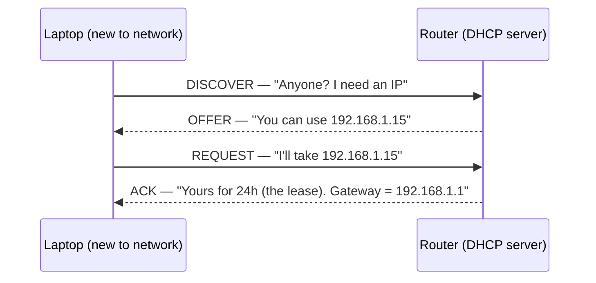
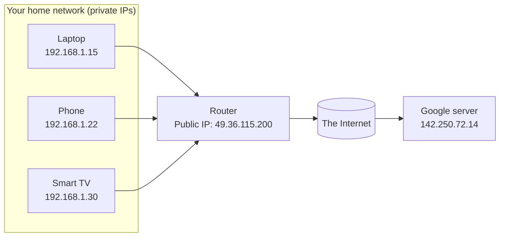
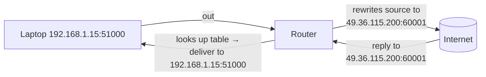
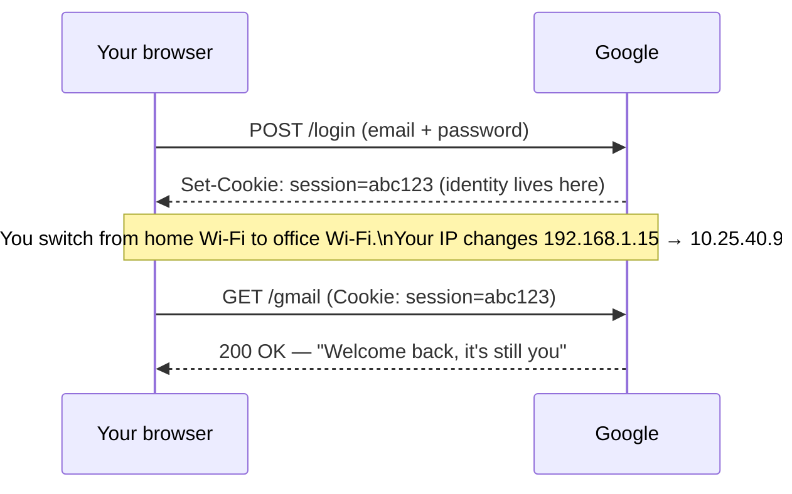

# Q1 — Why doesn't my laptop keep one permanent IP address everywhere?

> **My question:** My laptop is the same physical machine. Why does it get
> `192.168.1.15` at home, `10.0.0.24` at a café, and `172.16.5.101` at the
> office? Why not one fixed address? And if the IP keeps changing, how does
> Google still know it's *me*?

---

## Short answer

An **IP address is not the identity of your device — it's the identity of your
*position on a network right now***. When you join a new network, that network
hands you a fresh address (via **DHCP**), because the address only has meaning
*inside that network*. The permanent thing on your laptop is the **MAC address**
(hardware ID), and your *identity to a website* is a **session token in a
cookie**, not your IP.

Three different things are doing three different jobs — people confuse them:

| Thing | What it identifies | Does it change? | Analogy |
|-------|-------------------|-----------------|---------|
| **MAC address** | The network hardware in your device | Rarely (but modern devices *randomize* it per Wi-Fi for privacy) | Your fingerprint |
| **IP address** | *Where* you are attached on a network | Every time you switch networks | Your current hotel room number |
| **Session token (cookie)** | *You*, the logged-in user | Only when you log out / it expires | Your membership card |

---

## First-principles build-up

### Step 1: What is an IP address actually *for*?

Its one job: **routing** — letting routers forward a packet toward the right
place. For routing to work efficiently, addresses must be **grouped by location**
(a "subnet"). All devices on your home Wi-Fi share a prefix like `192.168.1.x`.
That grouping is what lets a router say "anything starting `192.168.1` is *my*
local devices; everything else, send upstream."

> **Key consequence:** an address that means "I'm in the `192.168.1` group" is
> meaningless the moment you walk into a network that uses `10.0.0.x`. It *must*
> change. A permanent global IP per laptop would destroy the grouping that makes
> routing scale to billions of devices.

### Step 2: Who hands out the address? DHCP.

When you join Wi-Fi, your laptop shouts a request; the router (running a **DHCP**
server) leases it an address for a while.

That "lease" is why the address is temporary *even on the same network* — leases
expire and can be reassigned. This is **DHCP** (Dynamic Host Configuration
Protocol), and it's the machinery your OS hides behind "Connected ✅".

### Step 3: Private vs public IP — the address you see is not the address the world sees

The `192.168.x.x`, `10.x.x.x`, `172.16–31.x.x` ranges are **private** — reusable
inside every home and office on Earth. They are *not* routable on the public
internet. Your router owns one **public IP** (from your ISP), and every device
behind it shares that single public address to the outside world.

To Google, all three devices *look like* `49.36.115.200`.

### Step 4: Then how does the router know which reply goes to which device? → NAT

This is the question the private/public split forces. The router keeps a
**translation table (NAT — Network Address Translation)**. When your laptop
sends a request, the router rewrites the source to its public IP **and remembers
the mapping using port numbers**:

| Internal (private) | External (public) |
|--------------------|-------------------|
| `192.168.1.15:51000` | `49.36.115.200:60001` |
| `192.168.1.22:49500` | `49.36.115.200:60002` |

When a reply arrives for `:60001`, the router looks it up and forwards it to the
laptop; `:60002` goes to the phone. **That's NAT** — one public IP multiplexed
across many devices via ports.

### Step 5: So how does Google know it's still *me* after my IP changes?

It doesn't rely on your IP for identity. On login, the server issues a **session
token** stored in a **cookie**. Every request carries it:

Identity travels **in the request**, not in the IP. This is exactly why you stay
logged in when you move from Wi-Fi to mobile data mid-session.

---

## How real systems do this at scale

The "your IP is a location, not an identity" principle scales up into some of the
biggest infrastructure on the internet:

- **CGNAT (Carrier-Grade NAT).** IPv4 addresses ran out. Mobile carriers (Jio,
  AT&T) now put *thousands of customers* behind one shared public IP using NAT at
  massive scale. This is why "block the abusive IP" is a blunt tool — you might
  ban a whole city block of users. Senior engineers rate-limit on **user/token +
  device fingerprint**, not IP alone.

- **Cloud servers get IPs from the cloud, too.** An AWS EC2 instance doesn't own
  its public IP; AWS assigns it. Reboot/replace the instance and the IP can
  change — which is *exactly why* you point your domain at a stable name via
  **DNS** (or an Elastic IP / load balancer), never hardcode the raw IP. Same
  principle as your laptop: the address is ephemeral, the *name* and the
  *identity layer* are stable.

- **Load balancers & the `X-Forwarded-For` header.** Behind an AWS ALB, Cloudflare,
  or Nginx, your backend sees the *proxy's* IP as the source, not the real client.
  This is **not NAT** (which rewrites L3/L4 headers on the same packet flow): a
  reverse proxy *terminates* the client's TCP connection and opens a brand-new
  connection to the backend, so the backend's peer address is legitimately the
  proxy. The real client IP is preserved in the `X-Forwarded-For` header. Beginners log the wrong IP for months because
  they read the socket's peer address instead of that header.

- **Sticky sessions vs stateless tokens.** Because a user's IP (and which server
  they hit) can change request-to-request behind a load balancer, large systems
  **do not** trust IP for identity or affinity. They either use signed,
  self-contained tokens (**JWT**) so any server can validate the user, or a shared
  session store (Redis). This is the production version of the cookie idea in
  Step 5 — scaled to millions of concurrent users across hundreds of servers.

- **IPv6 changes the picture (a bit).** With enough addresses for every grain of
  sand, devices *can* have globally unique IPs — so phones use **IPv6 privacy
  extensions** that rotate the address periodically *on purpose*, to stop
  advertisers tracking you by IP. Even when a permanent IP is *possible*, systems
  choose to keep it changing.

---

## Pitfalls ladder

| Level | Mistake | Why it bites |
|-------|---------|--------------|
| **Beginner** | "My laptop *has* an IP address" (one, forever) | It has *whatever the current network lent it*; it changes per network and per lease. |
| **Beginner** | Confusing MAC, IP, and login identity | Three layers, three jobs. MAC = local hardware, IP = network location, token = user identity. |
| **Intermediate** | Using client IP as a user identifier or for auth | IPs are shared (NAT/CGNAT) and change constantly → wrong user blocked, sessions broken. |
| **Intermediate** | Hardcoding a server's public IP in configs | Cloud IPs change on redeploy; use DNS / a stable endpoint. |
| **Senior** | Rate-limiting or ban-listing purely by IP | CGNAT means one IP = thousands of users; you nuke innocents. Combine IP + token + fingerprint + behavior. |
| **Senior** | Reading socket peer IP behind a proxy | You log the load balancer, not the user. Trust `X-Forwarded-For` **only** from proxies you control (it's spoofable otherwise). |

---

## Quick check (answer out loud)

1. Why *must* your IP change when you switch from home to office Wi-Fi?
   *(Because an IP encodes your position within a specific network's address
   group; it's meaningless on a different network.)*
2. Your home laptop, phone, and TV all show up to Google as one IP. What lets the
   router deliver each reply back to the right device? *(NAT + port numbers.)*
3. You move from Wi-Fi to mobile data mid-email. Your IP changes but you stay
   logged in. Why? *(Identity is in the session token/cookie, not the IP.)*
4. Why is "ban the IP" a dangerous moderation strategy in 2026? *(CGNAT — one
   public IP can front thousands of unrelated users.)*

---

## Connects to

- **Q2** ([`02-packets-loss-and-ordering.md`](./02-packets-loss-and-ordering.md)) —
  those port numbers NAT uses are part of TCP/UDP, which is also where ordering
  and loss are handled.
- **DNS** (`foundations/07-dns-domains.md`) — the stable *name* layer that exists
  precisely because IPs are not stable.
- **HTTPS / sessions** (`foundations/11-https-ssl-tls.md`) — how the identity
  token is kept secret in transit.
