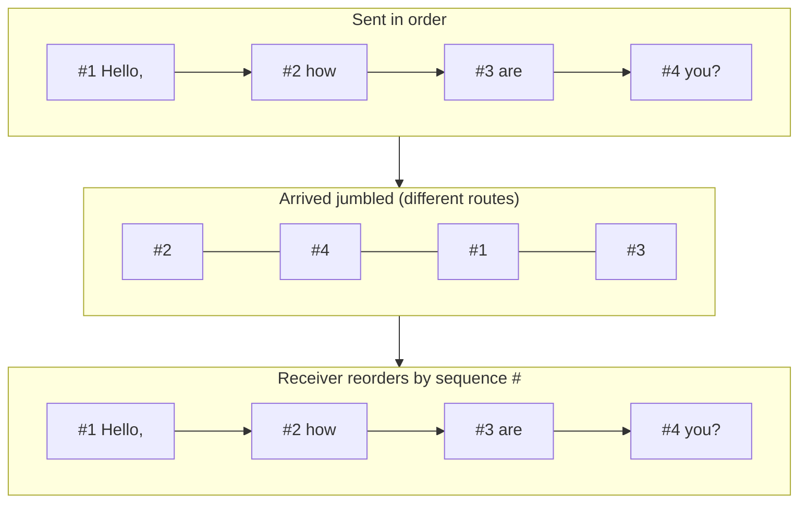
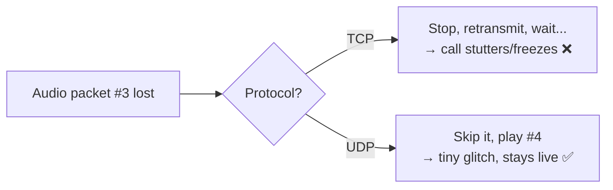

# Q2 — If messages are split into packets, can't they get lost or arrive out of order?

> **My question:** A long message is broken into packets, and each packet can take
> a different route. So packets can arrive in the wrong order, be delayed,
> duplicated, or lost entirely. Doesn't that break everything? How does my file
> download still arrive perfectly while a video call just glitches?

---

## Short answer

Yes — packets **can** be lost, reordered, delayed, or duplicated. That's not a
bug; the internet was *designed* assuming this happens. The network layer (IP)
makes **zero delivery guarantees** — it only does "best effort." Reliability is a
**choice made by the software on top**:

- **TCP** = "deliver everything, in order, no matter what." It numbers packets,
  reorders them at the receiver, and **retransmits** anything lost. Used for web
  pages, downloads, email, APIs — anywhere *correctness > speed*.
- **UDP** = "fire and forget, keep it fast." No reordering, no retransmission. If
  a packet is lost, skip it and move on. Used for video calls, live streaming,
  games — anywhere *speed > perfection*.

> The internet's genius: the *network* stays dumb and simple ("best effort"), and
> the *endpoints* decide how much reliability they want. This is the **end-to-end
> principle**.

---

## First-principles build-up

### Step 1: Why split a message into packets at all?

Imagine sending a 1 GB file as one giant blob. If the link hiccups at 999 MB, you
restart from zero. And while your blob hogs the wire, nobody else can send
anything. Splitting into small **packets** (~1,500 bytes each) fixes both:

- **Resilience:** lose one packet → resend *just that packet*, not the whole file.
- **Independent routing:** packets can take different paths around congestion or a
  dead link — the internet reroutes automatically.
- **Fair sharing:** routers interleave packets from many connections, so millions
  of users share the same wires at once.

This packet-switching design is *the* reason the internet scales to billions of
devices.

### Step 2: What the network promises → almost nothing

The IP layer only tries its best. Packets genuinely can:

| Failure | Why it happens |
|---------|----------------|
| **Reordered** | Different packets take different routes with different delays |
| **Delayed** | A router along the path is congested |
| **Duplicated** | A retransmission arrives *and* the original showed up late |
| **Lost** | A congested router's buffer is full → it drops packets |
| **Corrupted** | Electrical noise flips bits (a checksum catches this) |

So *something* has to clean this up — or decide it doesn't care.

### Step 3: TCP — the "I want everything, correctly" contract

TCP tags every chunk with a **sequence number** so the receiver can reassemble
the original order and detect gaps.



**Lost packet? TCP retransmits.** The receiver acknowledges (**ACK**) what it got;
a gap or a timeout tells the sender to send the missing piece again:

```mermaid
sequenceDiagram
    participant S as Sender
    participant R as Receiver
    S->>R: Packet #1
    S->>R: Packet #2
    S-->>R: Packet #3  (LOST in transit ✗)
    S->>R: Packet #4
    R-->>S: ACK — "got 1,2,4; I'm missing 3"
    S->>R: Packet #3 (retransmit)
    R-->>S: ACK — "complete ✓, delivered in order to the app"
```

The application (browser, file downloader) only ever sees the clean, ordered,
complete stream. All the mess above is hidden. **That's why a download is byte-
perfect even over a flaky connection.**

### Step 4: UDP — the "just keep going" contract

Now picture a live call. If packet #3 of your audio is lost, should the call
**freeze** while TCP retransmits it? By the time #3 arrives, that moment of speech
is already in the past — replaying it late is worse than skipping it. So real-time
media uses **UDP**: no ordering guarantee, no retransmit. A lost packet becomes a
tiny audio blip or a momentarily blocky video frame, and the conversation flows
on.



### Step 5: The rule of thumb

| Application | Protocol | On packet loss |
|-------------|----------|----------------|
| Web page / API call | TCP | Retransmit — page must be correct |
| File / app download | TCP | Retransmit until byte-perfect |
| Email | TCP | Every byte must arrive |
| Video / voice call | UDP | Skip it — stay real-time |
| Live sports stream | UDP-based | Drop frames over stalling |
| Online game (position updates) | UDP | Skip — the *next* update is what matters |

> **The deciding question:** *"Is a slightly late-but-perfect delivery useful, or
> is stale data worthless?"* If stale data is worthless (live media, games), pay
> nothing for reliability — use UDP.

---

## How real systems do this at scale

The TCP-vs-UDP trade-off is a live design decision inside every big system:

- **Netflix / YouTube (video-on-demand) use TCP — via HTTP.** Surprising, since
  it's video! But VOD isn't truly "live": the player **buffers ahead** several
  seconds, so TCP has time to retransmit lost packets before you reach them. They
  use **Adaptive Bitrate Streaming (HLS/DASH)** — the video is cut into small
  segments at multiple qualities, and the player *downgrades resolution* instead
  of dropping frames when your bandwidth dips. The buffer is what makes reliable
  TCP viable for video.

- **Zoom / Google Meet / WhatsApp calls use UDP.** True real-time, no buffer to
  hide behind. They pile cleverness *on top of* UDP: **jitter buffers** (a tiny
  delay to smooth out reordering), **Forward Error Correction** (send redundant
  data so a lost packet can be *reconstructed* without asking again), and
  **codecs that conceal loss** (interpolate a missing audio slice). This is the
  senior move: get UDP's speed, but engineer *graceful* degradation.

- **QUIC & HTTP/3 — the modern twist.** Google noticed TCP has a nasty flaw called
  **head-of-line blocking**: if you multiplex many requests over one TCP
  connection and *one* packet is lost, *all* streams stall waiting for that
  retransmit. So they built **QUIC**: reliability, ordering, and encryption
  rebuilt *on top of UDP*, with **independent streams** so one lost packet only
  stalls its own stream. HTTP/3 runs on QUIC. It's now used by Google, Meta,
  Cloudflare, and much of the web. Lesson: TCP vs UDP isn't sacred — engineers
  rebuild the reliability they want, where they want it.

- **Online games send small UDP updates constantly.** A player's position 40 ms
  ago is useless — the *newest* update already superseded it, so retransmitting
  lost ones is pointless. Games layer **client-side prediction** and
  **interpolation** over UDP to hide loss and lag.

- **Congestion control keeps the internet from collapsing.** TCP doesn't just
  resend — it *slows down* when it detects loss (interpreting loss as "the network
  is congested"). Algorithms like **CUBIC** and Google's **BBR** decide how fast
  to send. This is why one greedy download doesn't starve everyone else: the
  endpoints cooperatively back off. UDP apps must implement their *own* congestion
  control or they'd flood the network — a real failure mode of naive UDP tools.

---

## Pitfalls ladder

| Level | Mistake | Why it bites |
|-------|---------|--------------|
| **Beginner** | "The internet delivers my data reliably" | The *network* doesn't — **TCP** does. IP is best-effort only. |
| **Beginner** | "UDP is just a worse TCP" | UDP is a *deliberate* choice for when late data is useless. Different job, not lesser. |
| **Intermediate** | Using TCP for real-time media | Retransmits cause stutter/freeze; users prefer a small glitch over a stall. |
| **Intermediate** | Assuming TCP messages have "boundaries" | TCP is a **byte stream**, not discrete messages — two `send()`s can arrive glued together; you must frame messages yourself. |
| **Senior** | Multiplexing everything over one TCP connection | **Head-of-line blocking**: one lost packet stalls all streams. QUIC/HTTP-3 exists to fix this. |
| **Senior** | Rolling your own UDP protocol with no congestion control | You flood the network, cause loss for everyone, and get *worse* throughput than TCP. Reliability/ordering/backoff are hard-won for a reason. |

---

## Quick check (answer out loud)

1. Why does splitting a message into packets make the internet *more* reliable,
   not less? *(Lose one packet → resend just that one; packets reroute around
   failures; the wire is shared fairly.)*
2. Packets `#2 #4 #1 #3` arrive. How does TCP hand the app `#1 #2 #3 #4`?
   *(Sequence numbers → receiver reorders before delivering upward.)*
3. Why does a video *call* tolerate a lost packet but a file *download* cannot?
   *(Calls are real-time — a late packet is useless (UDP, skip). Downloads must be
   byte-perfect (TCP, retransmit).)*
4. Netflix streams video yet uses TCP. How does it get away with it? *(It buffers
   seconds ahead, so retransmits complete before playback catches up; it drops
   quality, not frames.)*
5. What problem does QUIC/HTTP-3 solve that plain TCP couldn't? *(Head-of-line
   blocking — independent streams over UDP so one lost packet doesn't stall the
   rest.)*

---

## Connects to

- **Q1** ([`01-why-ip-address-changes.md`](./01-why-ip-address-changes.md)) — the
  **port numbers** TCP/UDP use are what NAT keys on to route replies to the right
  device.
- **HTTP basics** (`foundations/06-http-basics.md`) — HTTP rides on TCP (HTTP/1.1,
  HTTP/2) or QUIC/UDP (HTTP/3).
- **HTTPS / TLS** (`foundations/11-https-ssl-tls.md`) — TLS assumes the reliable,
  ordered stream TCP provides (or QUIC rebuilds).
