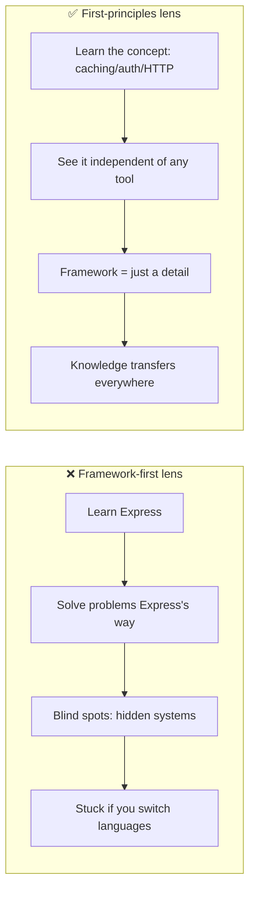
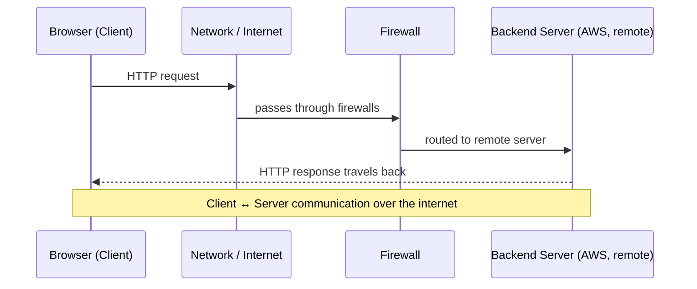
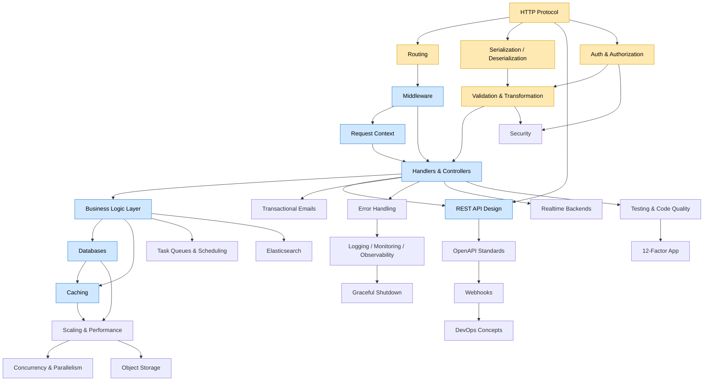

# Video 1 — Roadmap for Backend from First Principles

> **Series:** Backend from First Principles
> **Channel:** Sriniously
> **Video URL:** https://www.youtube.com/watch?v=0Rwb4Xmlcwc
> **Duration:** 31:24
> **Published:** 2024-09-23
> **Playlist:** https://www.youtube.com/playlist?list=PLui3EUkuMTPgZcV0QhQrOcwMPcBCcd_Q1

---

## 1. TL;DR (read this if you read nothing else)

This first video is **not** a deep dive into one topic. It is the **map of the whole course**. The instructor lays out ~30–40 upcoming videos and the *order* in which backend concepts should be learned so they click together.

The single most important idea:

> **Backend engineering is NOT just "building CRUD APIs."** It is the discipline of building **reliable, scalable, fault-tolerant, maintainable, and efficient systems**.

And the reason to learn it "from first principles" instead of starting with a framework (Express, Spring Boot, Rails):

- Frameworks make you see problems *through the lens of that framework* → **blind spots**.
- If you understand the **underlying systems**, your knowledge **transfers across languages** (e.g., Ruby → Go).

---

## 2. The Big Idea: Why "First Principles"?

The instructor argues there are **three structural problems** with how most people learn backend today.

### Problem 1 — "Too much, too scattered"
There are hundreds of resources but no agreed **priority** or **big picture**. People spend *years* piecing concepts together because they started from a narrow training scope (college / bootcamp / a "copy-paste" course) and built on top of that with trial-and-error.

### Problem 2 — "Framework / language tunnel vision"
You learn backend *through* Express, or Spring Boot, or Rails. That means:
- You solve problems using the vocabulary and abstractions of that ecosystem.
- You develop **blind spots** for concepts the framework hides from you.
- If the company migrates to a different language for performance (e.g., Ruby → Go), you can't transfer what you "know" because you never learned the *underlying system*.

> 💡 **First-principles takeaway:** Learn the concept (e.g., *what is caching?*) independent of *how Express implements it*. Then the framework becomes a detail, not a crutch.

### Problem 3 — "Copy-paste without understanding"
People ship code from tutorials/libraries without understanding how it works under the hood — which is dangerous for systems that need to be reliable and secure.

---

## 3. What Is a Backend, Really? (The Mental Model)

Before the syllabus, the video builds the **foundational mental model**: *how does a request actually travel?*

A request from your browser does **not** magically reach a server. It hops through many layers:

**Key vocabulary introduced here (jargon, defined simply):**

| Term | Plain-English Meaning |
|------|----------------------|
| **Client** | The thing asking for something (your browser, a mobile app). |
| **Server** | The remote computer that listens for requests and sends back responses. |
| **Request** | A message from client → server asking for data or an action. |
| **Response** | The message server → client with the result. |
| **Firewall** | A filter that decides which network traffic is allowed in/out. |
| **Hop** | One step a packet takes as it moves across the network. |
| **AWS** | Amazon Web Services — cloud where many backend servers live. |

The rest of the course is essentially: **zoom into each box and arrow above and explain what's really happening.**

---

## 4. The Full Roadmap (in learning order)

Below is the complete syllabus from the video, grouped into logical modules. Each row = what the instructor says will be covered.

### Module A — Foundations of Communication
| # | Topic | What's covered |
|---|-------|----------------|
| 1 | **How backend systems work** | Request flow: browser → network → firewalls → internet → AWS server → response. Client/server communication. |
| 2 | **HTTP protocol** | Raw HTTP messages, headers (request / representation / general / security), methods (GET/POST/PUT/DELETE) & semantics, CORS & preflight requests, responses & status codes, HTTP caching (ETag, `max-age`), HTTP/1.1 vs 2.0 vs 3.0, content negotiation, persistent connections, compression (gzip / deflate / brotli), SSL/TLS/HTTPS. |

### Module B — Routing & Data Shapes
| # | Topic | What's covered |
|---|-------|----------------|
| 3 | **Routing** | Mapping URLs → server logic; relation to HTTP methods; path & query params; static / dynamic / nested / hierarchical / catch-all / wildcard / regex routes; API versioning; deprecation; route grouping; securing & optimizing route matching. |
| 4 | **Serialization & Deserialization** | Translating data for the wire; text (JSON/XML) vs binary (Protobuf) formats & performance; JSON types (strings/numbers/booleans/arrays/objects); nested objects; mapping to native structures (Python dict, Go struct, JS object); common errors (missing/extra fields, null, dates/timezones); custom serialization; injection risks; validate **before** deserializing; JSON Schema; performance trade-offs. |

### Module C — Identity, Trust & Clean Input
| # | Topic | What's covered |
|---|-------|----------------|
| 5 | **Authentication & Authorization** | Stateful vs stateless; basic auth; bearer tokens; sessions; JWT; cookies; OAuth2 & OpenID Connect; API keys; MFA; salting & hashing; cryptography; RBAC / ABAC; securing cookies; CSRF / XSS / MITM defense; audit logging; rate limiting; account lockout; **timing attacks**; consistent error messages. |
| 6 | **Validation & Transformation** | Syntactic / semantic / type validation; client- vs server-side; fail-fast; type casting; date formats; normalization (lowercase email, trim, country codes); sanitization (SQL injection); relationship & conditional & chained validation; meaningful/aggregated error messages; masking errors; performance. |

### Module D — The Request Pipeline
| # | Topic | What's covered |
|---|-------|----------------|
| 7 | **Middleware** | What/when; pre-request vs post-response; chaining & ordering; the `next()` function; short-circuiting; security/CORS/CSRF/rate-limit/auth/logging/error/compression/body-parsing middlewares; performance & correct ordering. |
| 8 | **Request Context** | Request-scoped state/metadata; lifecycle; components (request metadata, session/user, trace IDs, request-specific data); use cases (auth, rate limiting, tracing, logging); timeouts & cancellation; best practices (lightweight, cleanup, avoid tight coupling). |
| 9 | **Handlers & Controllers (MVC)** | MVC pattern; controllers/services responsibilities; reducing code with middleware; centralized error handling; CRUD ↔ HTTP method mapping; pagination / search / sort / filter; best practices. |

### Module E — API Design & Data
| # | Topic | What's covered |
|---|-------|----------------|
| 10 | **REST Architecture & API Design** | Resource-oriented design; HTTP semantics; filtering/pagination; versioning (URI / header / query / media type); OpenAPI spec; content negotiation; exceptions; client caching (ETags); optimizing large requests/responses. |
| 11 | **Databases** | Relational vs non-relational; ACID; CAP theorem; queries & joins; schema design; indexing; query optimization; caching; connection pooling; constraints/transactions/concurrency; ORMs & trade-offs; migrations. |
| 12 | **Business Logic Layer (BLL)** | Request-cycle layers (presentation / business / data-access); SOLID; services, domain models, business tools, business validation; service-layer design; error propagation. |

### Module F — Performance & Asynchrony
| # | Topic | What's covered |
|---|-------|----------------|
| 13 | **Caching** | Need vs persistence; memory/browser/database & client/server caching; strategies (cache-aside, write-through, write-behind, write-back, read-through); eviction (LRU/LFU/TTL/FIFO); invalidation (manual/TTL/event); L1 in-memory / L2 distributed / hierarchical; static assets & API-response caching; Redis query caching; hit/miss ratio. |
| 14 | **Transactional Emails** | Use cases; anatomy (subject, preheader, body, header, CTA, footer); personalization with dynamic params. |
| 15 | **Task Queues & Scheduling** | Use cases (email, image processing, 3rd-party APIs, payments/webhooks, heavy compute); components (producer, queue, consumer, broker, backend); dependencies (chain, parent/child); task groups; concurrency; retries; prioritization; rate limiting. |
| 16 | **Elasticsearch / Full-Text Search** | Why & how (inverted index, TF-IDF, segments, shards); type-ahead / log analytics / social search; index management; basic & full-text search; relevance scoring; optimization (text vs keyword, analyzers, boosting, pagination); filtering/aggregation/fuzzy; Kibana; best practices. |

### Module G — Resilience, Ops & Security
| # | Topic | What's covered |
|---|-------|----------------|
| 17 | **Error Handling** | Types (syntax/runtime/logical); strategies (fail-safe / fail-fast / graceful degradation / prevention); catch-early, don't swallow, custom errors; global handlers; user-facing errors; monitoring (Sentry, ELK); alerts (email/slack). |
| 18 | **Config Management** | Flexibility & decoupling env-specific settings; secrets/feature flags; static/dynamic/sensitive configs; sources (env file / JSON / YAML); env vars vs CLI flags vs static files. |
| 19 | **Logging, Monitoring & Observability** | Logging vs tracing vs monitoring vs observability; log types & levels (debug/info/warn/error/fatal); structured logging; centralized logging, rotation, retention; monitoring (infra/APM/uptime) with Prometheus/Grafana; alert fatigue; 3 pillars (logs/metrics/traces). |
| 20 | **Graceful Shutdown** | Why (restarts, cloud scaling, microservices, long jobs); signals (SIGTERM/SIGINT/SIGKILL); steps: capture signal → stop accepting → finish in-flight → close resources → terminate. |
| 21 | **Security** | Attacks (SQL/NoSQL injection, XSS, CSRF, broken auth, insecure deserialization); secure-design principles (least privilege, defense in depth, fail-secure defaults, separation of duties, security by design); input validation/sanitization; rate limits; CSP; CORS; same-site cookies; monitoring. |

### Module H — Scale, Code Quality & Ecosystem
| # | Topic | What's covered |
|---|-------|----------------|
| 22 | **Scaling & Performance** | Metrics (response time, resource utilization); bottlenecks; DB optimization (avoid N+1, joins, lazy loading, indexes, batching); memory-leak avoidance; network overhead (payload size, compression); performance testing/profiling; no premature optimization; graceful degradation; offload non-critical work. |
| 23 | **Concurrency & Parallelism** | Difference; concurrency for I/O-bound; parallelism for CPU-bound. |
| 24 | **Object Storage & Large Files** | Use cases (AWS S3); chunking & streaming; multipart uploads. |
| 25 | **Realtime Backends** | WebSockets; Server-Sent Events; pub/sub architecture. |
| 26 | **Testing & Code Quality** | Unit / integration / e2e / functional / regression / performance / load / stress / UAT / security testing; TDD; CI/CD automation; linting/formatting; cyclomatic complexity; maintainability index. |
| 27 | **12-Factor App** | The classic methodology for building cloud-native apps. |
| 28 | **OpenAPI Standards** | Need/benefits; docs automation; Swagger→OpenAPI history; versions 3.0/3.1; key concepts (paths, parameters, schemas, components, security, responses); API-First Development; tools (Swagger UI, Postman, Redoc). |
| 29 | **Webhooks** | Use cases (notifications, 3rd-party); API (polling) vs webhook (push); components (URL, event trigger, payload, method, response); signature verification, HTTPS, quick response, retry, logging; testing with ngrok; real-world (Stripe, GitHub, Slack, Discord, Twilio). |
| 30 | **DevOps Concepts** | CI/CD; IaC; config mgmt; version control; Docker / Kubernetes / pipelines; horizontal vs vertical scaling; blue-green & rolling deployments. |

---

## 5. Learning Dependency Graph

This is the **prerequisite map**. Arrows mean *"you should understand A before B makes full sense."* Foundations at the top feed everything below.

**How to read it:** Start at the yellow "foundation" nodes (HTTP, Routing, Serialization, Auth, Validation). They have almost no prerequisites. Everything blue (the "core") builds directly on them. The grey/terminal nodes (Security, Scaling, Testing, DevOps) sit at the end because they require you to already have a working system to secure, scale, and operate.

---

## 6. Jargon Buster (newbie glossary)

Grouped by where the term first appears in the roadmap. Each is explained as if you've never heard it.

### General / philosophy
- **Backend** — The hidden "kitchen" of an app: servers, databases, and logic that prepare data the visible app (frontend) shows.
- **CRUD** — *Create, Read, Update, Delete.* The four basic things you can do to data. "Just CRUD APIs" = apps that only do these four.
- **Fault-tolerant** — Keeps working (or fails safely) even when parts break.
- **Scalable** — Can handle more load (more users/requests) by adding resources.
- **Maintainable** — Easy for humans to read, change, and fix over time.
- **First principles** — Understanding something from its most basic truths instead of memorizing a tool's rules.

### HTTP & networking
- **HTTP** — The language browsers and servers use to talk. Text-based request/response.
- **Header** — Extra metadata sent with a request/response (e.g., "what format do you want back?").
- **Status code** — A 3-digit number summarizing the result (200 = OK, 404 = not found, 500 = server error).
- **CORS (Cross-Origin Resource Sharing)** — Rules that let a webpage on one domain call an API on another domain.
- **Preflight request** — A browser's "asking permission first" OPTIONS check before a cross-origin request.
- **ETag / max-age** — HTTP caching tags: ETag = "version fingerprint" of a resource; max-age = "how long to reuse it."
- **Compression (gzip / deflate / brotli)** — Shrinking data before sending so it travels faster.
- **SSL / TLS / HTTPS** — The encryption layer that makes HTTP private and tamper-proof (the "S" in HTTPS).

### Routing & data
- **Route** — A URL pattern mapped to server code (e.g., `/users/123`).
- **Path parameter** — Variable part of a URL path (`123` in `/users/123`).
- **Query parameter** — Key/value after `?` (`?page=2`).
- **Serialization** — Turning in-memory data into a transfer format (e.g., object → JSON text).
- **Deserialization** — The reverse: JSON text → in-memory object.
- **Protobuf** — A compact *binary* serialization format (faster/smaller than JSON, but not human-readable).
- **JSON Schema** — A contract describing what valid JSON must look like.

### Identity & input
- **Authentication** — *Who are you?* (proving identity — login).
- **Authorization** — *What are you allowed to do?* (permissions).
- **Stateful vs stateless** — Stateful = server remembers you (sessions); stateless = each request proves itself (tokens).
- **JWT (JSON Web Token)** — A signed token carrying identity claims; stateless auth.
- **OAuth2 / OpenID Connect** — Delegated login ("Log in with Google") standards.
- **API key** — A secret string identifying/authorizing a program calling your API.
- **MFA** — Multi-Factor Authentication (password + code from your phone).
- **Salting & hashing** — Storing passwords as one-way scrambles + random "salt" so they can't be reversed.
- **RBAC / ABAC** — Role-Based / Attribute-Based Access Control (permission models).
- **CSRF / XSS / MITM** — Common web attacks: Cross-Site Request Forgery, Cross-Site Scripting, Man-In-The-Middle.
- **Timing attack** — Inferring secrets from tiny differences in how long responses take.
- **Normalization** — Standardizing input (lowercase email, trim spaces).
- **Sanitization** — Cleaning input to remove attack payloads (e.g., SQL injection).

### Pipeline
- **Middleware** — Reusable code that runs *on the way in or out* of every request (logging, auth, compression).
- **Request Context** — A small bag of request-specific data (user, trace ID) passed through the code for one request's lifetime.
- **MVC** — Model-View-Controller: a pattern separating data, UI, and control logic.
- **Controller / Service / Repository** — Layers: controller handles requests, service holds logic, repository talks to the database.

### Data & performance
- **ACID** — Database guarantees: Atomic, Consistent, Isolated, Durable.
- **CAP theorem** — You can't have all three of Consistency, Availability, Partition-tolerance perfectly; you trade off.
- **Index** — A lookup structure (like a book index) making queries fast.
- **ORM** — Object-Relational Mapper: code that lets you use objects instead of raw SQL.
- **Migration** — A versioned script that changes the database schema safely.
- **Cache-aside / write-through / etc.** — Patterns for *when* data is read/written to cache vs database.
- **LRU / LFU / TTL / FIFO** — Eviction rules: Least Recently Used, Least Frequently Used, Time-To-Live, First-In-First-Out.
- **Hit / Miss ratio** — % of cache lookups found (hit) vs had to hit the DB (miss).
- **Inverted index** — The search trick Elasticsearch uses (maps words → documents, like a book index).
- **TF-IDF** — Term Frequency–Inverse Document Frequency: scores how important a word is to a document.
- **Shard** — A horizontal slice of a big dataset spread across machines.

### Ops & quality
- **Graceful shutdown** — Finishing in-flight work and releasing resources before a server stops.
- **SIGTERM / SIGINT / SIGKILL** — OS signals: "please stop" / "interrupt" / "force kill now."
- **Observability (3 pillars)** — Logs, Metrics, Traces — the three ways to understand a running system.
- **Alert fatigue** — Too many alerts until you ignore them all.
- **N+1 query problem** — Accidentally running 1 query + N follow-up queries instead of 1 efficient join.
- **Lazy loading** — Loading data only when needed (can help or hurt).
- **Concurrency vs Parallelism** — Concurrency = juggling many tasks (good for waiting on I/O); Parallelism = doing many at once (good for CPU work).
- **Pub/Sub** — Publish/Subscribe: senders broadcast, subscribers listen.
- **Webhook** — A URL you give someone so *they* push events to *you* (vs you polling them).
- **CI/CD** — Continuous Integration / Continuous Deployment: automatically test and ship code.
- **IaC** — Infrastructure as Code: define servers/networks in files, not by clicking.
- **Blue-green / rolling deployment** — Ways to release new versions with zero/low downtime.
- **12-Factor App** — 12 best-practice rules for building cloud-ready apps.
- **Cyclomatic complexity** — Count of independent paths through a function (higher = harder to test).
- **OpenAPI / Swagger** — A standard file describing your API so tools can document/test it automatically.
- **API-First** — Write the API spec *before* you write the code.

---

## 7. Key Takeaways

1. **Backend ≈ building trustworthy systems**, not just CRUD endpoints.
2. **Learn concepts, not just frameworks** — frameworks hide the systems you must understand; first-principles knowledge transfers across languages.
3. The course is **ordered deliberately**: communication foundations (HTTP) → request handling (routing, serialization, auth, middleware) → data & async (DB, caching, queues, search) → resilience/ops (errors, logging, security, scaling) → ecosystem (testing, OpenAPI, webhooks, DevOps).
4. **Everything connects** — see the dependency graph in §5. A request touches nearly every topic on its way in and out.

---

## 8. What's Next

The playlist's *second* video is **"Walk the path of a true backend engineer"** (03:53) and the *third* is **"What is a Backend, how do they work and why do we need them?"** (19:01) — these expand the mental model from §3 before diving into HTTP in video 5.

> 📌 Suggested study order for this repo: watch video 2 & 3 next (they deepen the "what is a backend" picture), then video 5 (HTTP) which is where the heavy foundational learning begins.
