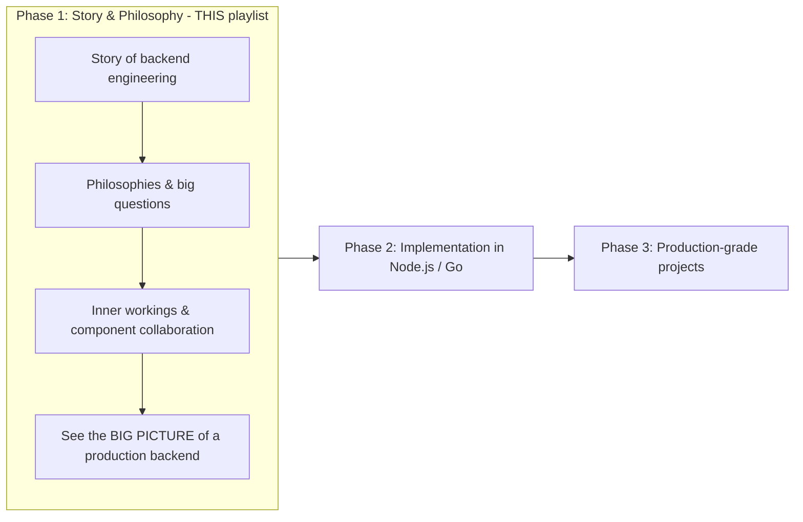
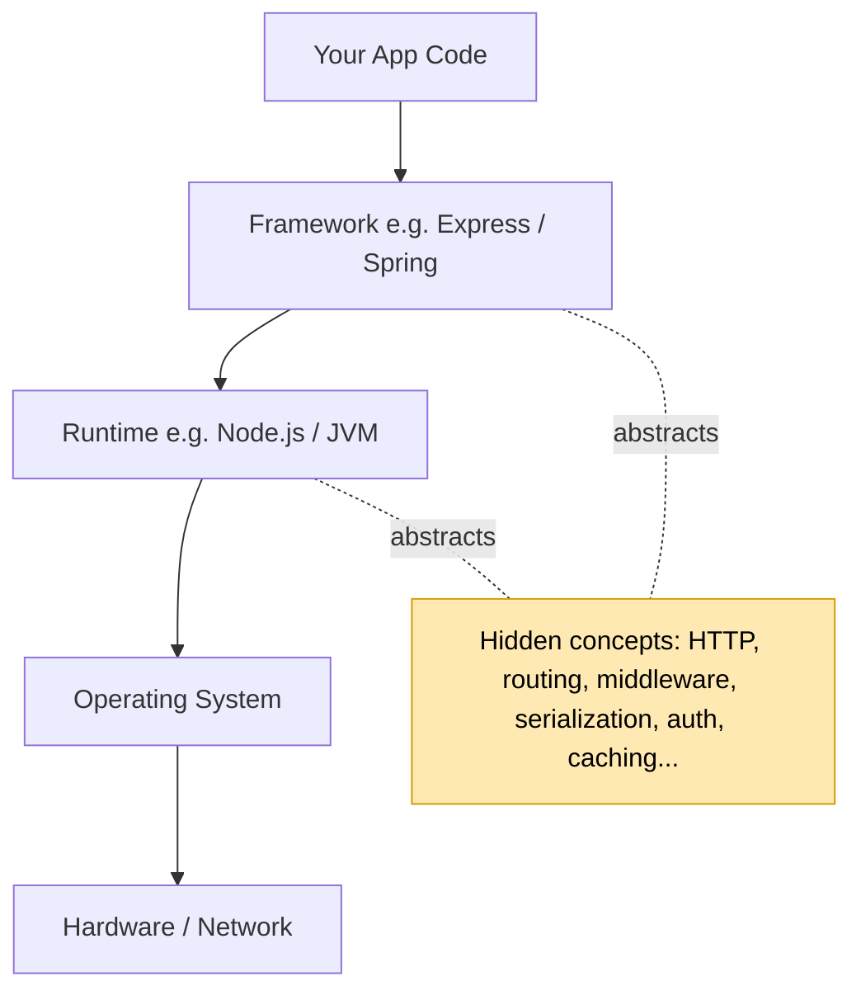
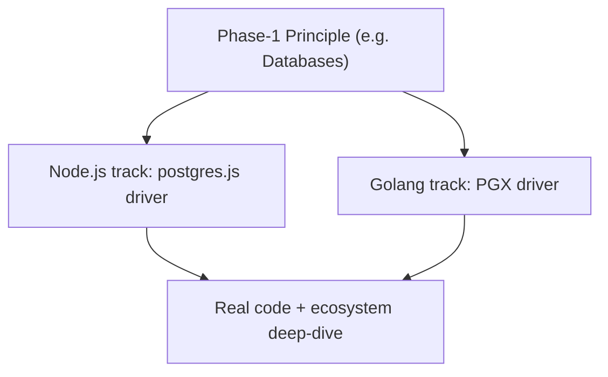
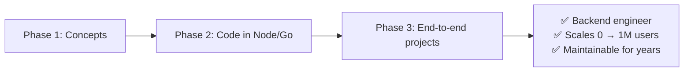

# Video 2 — Walk the Path of a True Backend Engineer

> **Series:** Backend from First Principles
> **Channel:** Sriniously
> **Video URL:** https://www.youtube.com/watch?v=3qFjZbFRSAU
> **Duration:** 03:53
> **Published:** 2024-09-23
> **Playlist position:** #2 of 23
> **Companion doc:** `2.1-deepening-the-path.md` (extra clarifications & visuals)

---

## 1. TL;DR

This is a **meta-video** — it tells you *how the whole course is structured* and *what to expect*, not a technical topic. The instructor lays out a **3-phase journey** to become a real backend engineer:

| Phase | Name | Where | What you do |
|-------|------|-------|-------------|
| **1** | **Story & Philosophy** | *This* playlist | Learn language-agnostic concepts & the big picture |
| **2** | **Implementation** | Future playlists (Node.js + Golang) | Deep-dive each principle in real code |
| **3** | **Production-grade Projects** | Future playlist | Build end-to-end systems with industry standards |

**End goal:** be able to build *real systems that scale from 0 → 1,000,000 users* and stay *maintainable* for years.

---

## 2. The Core Message: "Set your expectations first"

Before the "meat" (HTTP, databases, auth…), the instructor wants you to know **how to learn from these videos**:

> *"I want to tell everyone the **story of backend engineering** — the philosophies behind it, the big questions, and the inner workings and the collaborations between different components and machines."*

So the purpose of **Phase 1 (this playlist)** is **narration + big picture**, not code.

---

## 3. Phase 1 — Story & Philosophy (The Big Picture)

**What it covers**
- The **story**: a narrative of how pieces of a backend fit and cooperate.
- The **philosophies**: the "why" behind design decisions.
- The **big questions**: e.g., *how do requests travel? how do components stay in sync?*
- The **inner workings & collaborations** between components **and machines** (remember: a backend is often many computers talking).

**The key payoff**
> *"Help you appreciate the concepts that are **abstracted** by the languages, runtimes, frameworks and libraries that we use every day."*

In plain words: frameworks (Express, Spring, Rails) **hide** a lot of real machinery. Phase 1 trains you to *see* that hidden machinery so it's not a black box.

**Language-agnostic skills**
This playlist deliberately avoids locking you to one tool. The skills you build here work everywhere:

> *"This is the first step towards being a backend engineer with **language-agnostic skills** — skills which are beyond frameworks or any particular library."*

> 🔎 The yellow box is everything Phase 1 teaches you to *see through* the framework. (Deeper breakdown in `2.1-deepening-the-path.md`.)

---

## 4. Phase 2 — Implementation (in a Real Language)

Once foundations are clear, you move to **code**. This is a *separate* set of playlists.

- You must now **pick a language & ecosystem**.
- Instructor will release **two tracks**: **Node.js** and **Golang (Go)** — the two he uses daily.
- **One-to-one mapping**: most Phase-1 videos get a matching implementation video in Phase 2.
  > *"In a way most videos of this playlist will have an associated implementation-specific video in the next playlist."*
- **Example given**: the *databases* principle → implemented with **Postgres** using the **`postgres.js`** driver (Node) or the **`PGX`** driver (Go), covering *every* concept around it.

**Why two languages?** Seeing the *same principle* expressed in two different ecosystems proves the concept is universal — exactly the "language-agnostic" goal from Phase 1.

---

## 5. Phase 3 — Production-grade Projects

Everything converges:

> *"All our concepts, all our language-specific deep dives, all our philosophies… we will build **production-grade projects from end to end** with all the industry standards and best practices."*

- You build **several complete projects** you can follow along with.
- Output is not a toy — it's built to real-world standards.

**The promised outcome**
> *"By the end of this journey… you should be safely able to call yourself a backend engineer and… build real systems — systems that scale, systems that start from zero users and scale to a million users, systems that people can maintain over a long period of time."*

---

## 6. Why This Order Matters (first-principles reasoning)

The sequence is not arbitrary — it directly fixes the problems from Video 1 (framework tunnel-vision, scattered learning):

1. **Understand before implementing** → you learn the *concept* (caching, auth) before any framework's wrapper, so the tool becomes a detail, not a crutch.
2. **Language-agnostic first** → knowledge transfers across languages/jobs.
3. **Then code** → cements the abstract idea in something concrete (two ecosystems, to prove universality).
4. **Then full systems** → only now do you face *integration* and *trade-offs* (the hard parts of real engineering).

---

## 7. Jargon Buster (newbie glossary)

| Term | Plain-English Meaning |
|------|----------------------|
| **Language-agnostic** | A skill/concept that applies no matter which programming language you use. |
| **Language** | The syntax you write (JavaScript, Go, Python…). |
| **Runtime** | The engine that actually executes your code (Node.js for JS, the JVM for Java, etc.). |
| **Framework** | A structured toolkit that *ties your code together* and makes decisions for you (Express, Spring, Rails). |
| **Library** | A smaller, optional toolbox you call when you need it (e.g., a date formatter). |
| **Driver** | Code that lets your program *talk to* a database or service (e.g., `postgres.js`, `PGX`). |
| **Ecosystem** | The whole community of tools/libraries/conventions around one language. |
| **Node.js** | A JavaScript runtime (lets you run JS on servers, not just browsers). |
| **Golang (Go)** | A compiled, performance-focused language from Google, popular for backends. |
| **Postgres (PostgreSQL)** | A widely used open-source **relational database**. |
| **postgres.js** | The JavaScript driver for Postgres. |
| **PGX** | A popular Go driver for Postgres. |
| **Production-grade** | Built to the quality bar real companies require: reliable, secure, observable, scalable, testable. |
| **Industry standards / best practices** | The widely-accepted "right ways" the profession has learned to build software. |
| **Scale (0 → 1M users)** | Grow from no users to a million without rewriting everything. |
| **Maintainable** | Future developers (including future-you) can change it safely over years. |

---

## 8. Key Takeaways

1. This course is a **3-phase journey**: **Story/Philosophy → Implementation (Node & Go) → Production projects.**
2. **Phase 1 (this playlist) is concept-first and language-agnostic** — its job is to make the machinery *frameworks hide* visible.
3. Phase 2 proves each concept in **real code**, in **two languages**, with a 1:1 mapping to Phase-1 videos.
4. Phase 3 assembles everything into **end-to-end production systems** that scale to 1M users and stay maintainable.
5. The end state: you can legitimately call yourself a **backend engineer**.

---

## 9. What's Next

- **Video 3 — "What is a Backend, how do they work and why do we need them?"** (19:01): expands the "what is a backend" mental model from Video 1.
- **Video 4 — "Benefits of learning backend engineering from first principles"** (10:11): the *why* behind this whole approach.
- **Video 5 — "Understanding HTTP"** (1:18:13): the first heavy technical foundation.

> 📌 Tip: Keep a running "concept → where I'll see it in code" map as you go; it mirrors the Phase-1→Phase-2 mapping the instructor describes.
