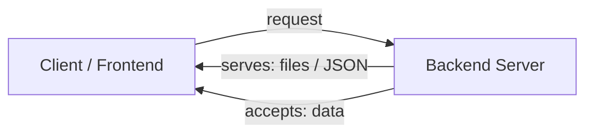
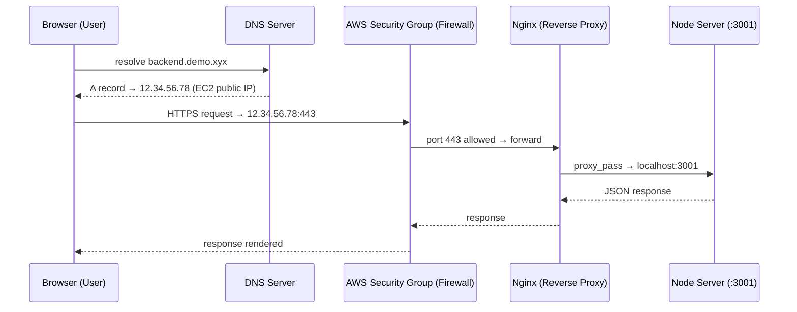
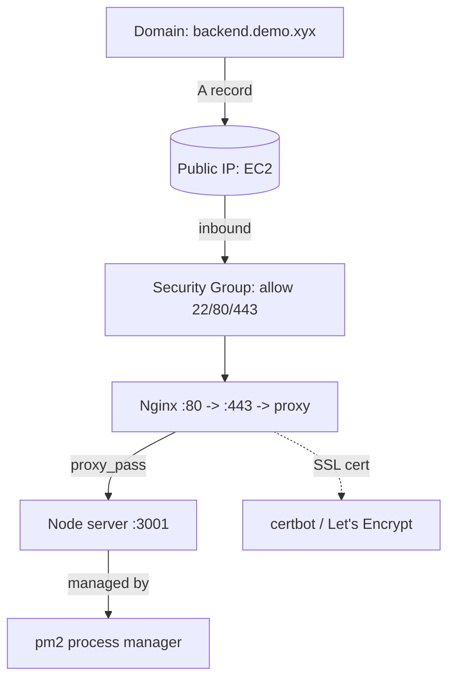
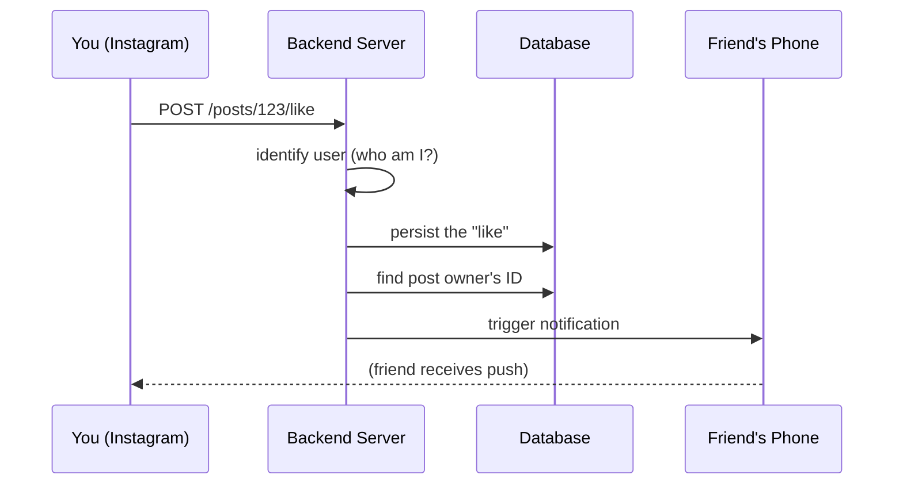
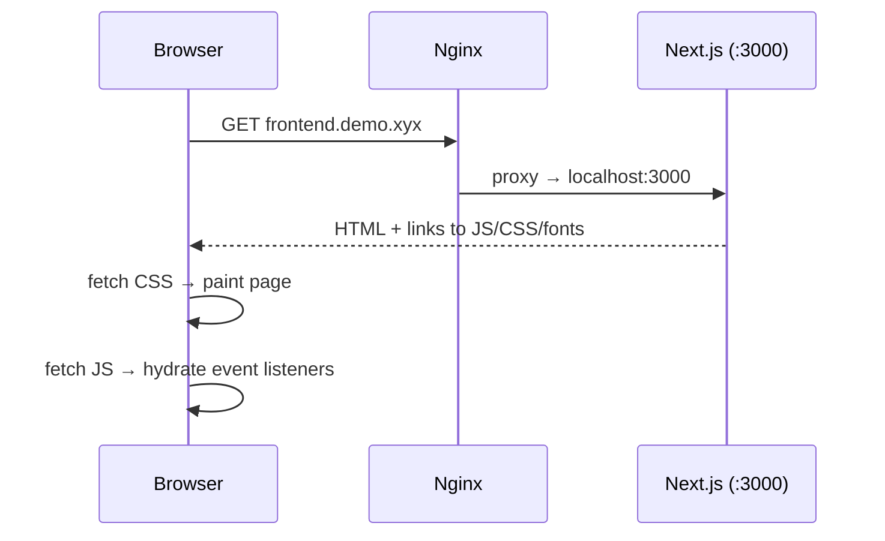

# Video 3 — What Is a Backend, How Do They Work, and Why Do We Need Them?

> **Series:** Backend from First Principles
> **Channel:** Sriniously
> **Video URL:** https://www.youtube.com/watch?v=6Ss4dJD9Kzg
> **Duration:** 19:01
> **Playlist position:** #3 of 23
> **Companion docs:** `3.1-deepening.md` (extra clarifications & visuals) · `3_questions.md` (practice questions + answers with code)

---

## 1. TL;DR

- A **backend** is traditionally *a computer listening for requests* (HTTP, WebSocket, gRPC…) on an open port (80/443) over the internet, **serving** content (files, JSON) and **accepting** data.
- Following a **real demo**, a request travels: **Browser → DNS → AWS EC2 → Firewall (security group) → Nginx reverse proxy → Node server on `localhost:3001`**.
- The **essence of a backend** = **DATA**: fetch it, receive it, persist it, act on it.
- We **can't** just put backend logic in the frontend because of: (1) security/sandbox, (2) CORS, (3) databases & connection pooling, (4) computing power.

---

## 2. Traditional Definition of a Backend

> *"A computer which is listening for HTTP or websocket or grpc or any other kind of request through an open port… accessible over the internet, so that clients or other front ends can connect to it, send data to it, or receive data."*

It is called a **server** because it **serves** content — static files (images, JS, HTML) or **JSON** — and also accepts data the client sends.

---

## 3. The Holistic Request Flow (live demo walkthrough)

The instructor deployed a backend on **AWS EC2** and traced one request end-to-end. Here are the **hops**:

### Hop-by-hop (the physical path)

| # | Hop | What happens |
|---|-----|--------------|
| 1 | **Browser** | User types `backend.demo.xyx`. |
| 2 | **DNS server** | Looks up the domain. An **A record** maps the subdomain `backend.demo` → a public **IP address**. |
| 3 | **AWS EC2 instance** | That IP belongs to a running virtual machine in AWS. |
| 4 | **Firewall / Security Group** | AWS-native firewall. Only ports you *explicitly allow* get through (here: **22** SSH, **80** HTTP, **443** HTTPS). Block everything else. |
| 5 | **Nginx (reverse proxy)** | Listens on port **80**, redirects to **443** (HTTPS, cert handled by **certbot**), then **proxies** the request to `localhost:3001`. |
| 6 | **Node server** | The actual app, running on port **3001**, managed by **pm2**. Returns the response (e.g., `/users`). |

> 🔎 Notice the two layers of "routing": **DNS** routes the domain → IP (internet level); **Nginx** routes the request → the right local process (machine level).

---

## 4. Anatomy of the Demo Infrastructure

- **DNS A record**: points a subdomain to an IPv4 address. (A **CNAME** points to *another domain* instead.)
- **EC2**: a rented virtual computer in AWS's cloud.
- **Security group**: AWS's stateful firewall; default-deny, you open only needed ports.
- **Nginx**: a **reverse proxy** — sits *in front* of your app servers so redirects/TLS/config are managed centrally, not per server.
- **certbot**: auto-issues/renews free **SSL/TLS** certificates (the "S" in HTTPS).
- **pm2**: a process manager that keeps Node processes alive and lets you run frontend + backend on one machine (ports 3000/3001).

---

## 5. Why Do We Need Backends? (the "Like → Notification" story)

> *"Between you clicking the like button and your friend getting the notification, what exactly happened?"*

Steps the server performs:
1. Receives the request, identifies **who** you are.
2. **Persists** the like (saves it — usually in a **database**).
3. Looks up **whose** post you liked.
4. **Triggers** a notification to that user.

> 💡 The backend is the **centralized computer that holds the state of all users**. Your app only shows *your* slice; the server holds *everyone's* information so it can coordinate interactions.

### The one-word summary

> *"If you try to condense the responsibility and use of backend to a single word, it will be this: **DATA** — the need to fetch data, receive data, and persist data somewhere, and every action that deals with data."*

---

## 6. Why Not Just Do Everything on the Frontend?

The instructor deployed a **Next.js frontend** on the *same* EC2 to contrast. The flow:

**Key difference:** the frontend's JavaScript is *sent to* the browser and **executed by the browser** (the browser is the runtime). The backend **processes on the server** and sends back the *result*. Opposite models.

### The 4 reasons a backend is necessary

| # | Reason | Why the frontend can't do it |
|---|--------|------------------------------|
| 1 | **Security / Sandbox** | Browser JS runs in a **sandboxed** environment isolated from the OS — no raw filesystem or env-var access. A backend needs to write logs, read secrets, etc. |
| 2 | **CORS** | Browsers block JS calls to *other* domains unless the target sends CORS headers. Backends must freely call many external services. |
| 3 | **Databases** | Servers have **native DB drivers** (e.g., `pg` for Postgres, MongoDB driver) that hold **persistent, pooled socket connections**. Browsers can't maintain pooled DB connections — each user would open their own, overwhelming the DB. |
| 4 | **Computing power** | Frontends run on *anything* (a phone with 256 MB RAM, single core). Heavy business logic would lag/break. A centralized backend can be scaled up (more CPU/RAM) to serve millions. |

> 🔎 On databases specifically: a backend keeps a **connection pool** — a reusable list of open connections — because it may get *thousands of requests per second*. Creating/destroying a connection per request would overwhelm the database. Browsers have no clean way to do pooling or efficient query execution against a DB.

---

## 7. Frontend vs Backend Runtime (side-by-side)

| Aspect | Frontend | Backend |
|--------|----------|---------|
| Where code runs | **In the user's browser** | **On a server** (e.g., AWS EC2) |
| Runtime | Browser engine (V8 in Chrome…) | Node.js / JVM / Go runtime |
| Receives | HTML/JS/CSS, then executes | Raw requests, returns results |
| Filesystem access | ❌ sandboxed | ✅ full OS access |
| Database | ❌ no native drivers / pooling | ✅ native drivers + connection pool |
| External APIs | ⚠️ only with CORS headers | ✅ unrestricted |
| Compute | Limited by user's device | Scalable (add CPU/RAM) |
| Holds state | Only the current user's view | All users' state (centralized) |

---

## 8. Jargon Buster (newbie glossary)

| Term | Plain-English Meaning |
|------|----------------------|
| **Server** | A computer that "serves" data/Content to clients. |
| **Client** | The requester — browser, mobile app, another server. |
| **Port** | A numbered "door" on a machine (80 = HTTP, 443 = HTTPS, 22 = SSH). |
| **DNS** | The internet's phonebook: translates domain names → IP addresses. |
| **A record** | A DNS entry mapping a domain → an IPv4 address. |
| **CNAME** | A DNS entry mapping a domain → *another* domain name. |
| **Subdomain** | A prefix like `backend.demo.xyx` (here `backend.demo`). |
| **EC2** | AWS's virtual server (rented computer in the cloud). |
| **Security group** | AWS firewall; you allow only specific ports. |
| **Firewall** | A filter deciding which network traffic is allowed. |
| **Reverse proxy** | A server *in front* of your app that forwards requests (Nginx). |
| **Nginx** | Popular web server / reverse proxy. |
| **certbot** | Tool that auto-issues free SSL/TLS certs. |
| **SSL / TLS / HTTPS** | Encryption that makes HTTP private & tamper-proof. |
| **pm2** | Node.js process manager (keeps apps running). |
| **localhost** | "This machine" — `localhost:3001` = port 3001 on the same computer. |
| **Hydration** | When downloaded JS attaches event listeners so a page becomes interactive. |
| **Sandbox** | An isolated environment with limited access (browsers isolate JS). |
| **DOM** | The browser's representation of the page you can script. |
| **CORS** | Browser security policy restricting cross-domain JS calls. |
| **Native DB driver** | Language-specific code that talks efficiently to a database. |
| **Connection pool** | A reusable set of open DB connections (avoids reconnecting per request). |
| **Socket** | An open two-way communication channel over the network. |
| **Persistent connection** | A connection kept open and reused (not opened/closed each time). |
| **gRPC / WebSocket** | Alternative request protocols (RPC / live bidirectional). |
| **Next.js** | A React framework that also runs a server to send HTML/JS. |
| **Runtime** | The environment that actually executes your code. |
| **State** | Data that persists/represents the current situation (e.g., who liked what). |

---

## 9. Key Takeaways

1. A backend is a **listening server** that fetches/receives/persists **data** and performs actions on it.
2. A production request hops through **DNS → firewall → reverse proxy → app server**; each layer has a distinct job.
3. The backend is the **centralized source of truth / state** for all users (the like→notification example).
4. Frontend runs code **in the browser**; backend runs processing **on the server** — fundamentally different trust/resource models.
5. Backends exist because browsers are **sandboxed, CORS-restricted, can't pool DB connections, and have weak/variable compute** — none of which a server suffers from.
6. This mental model is the foundation everything else (HTTP, routing, auth, DBs…) builds on.

---

## 10. What's Next

- **Video 4 — "Benefits of learning backend engineering from first principles"** (10:11).
- **Video 5 — "Understanding HTTP for backend engineers"** (1:18:13) — the first deep technical foundation; you'll see the request/response messages that travel the path traced in this video.

> 📌 Mental bookmark: every later topic (routing, middleware, auth, caching) is a *component* sitting somewhere along the path Browser → … → your server. Keep this hop diagram handy.
