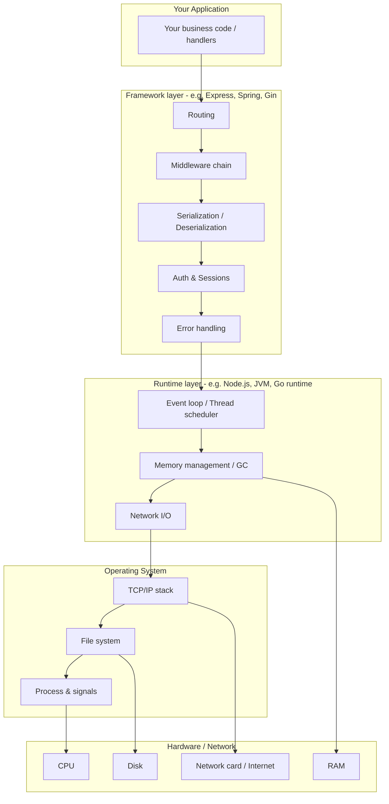
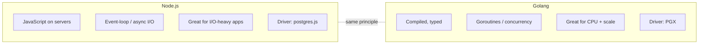
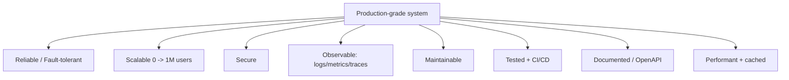
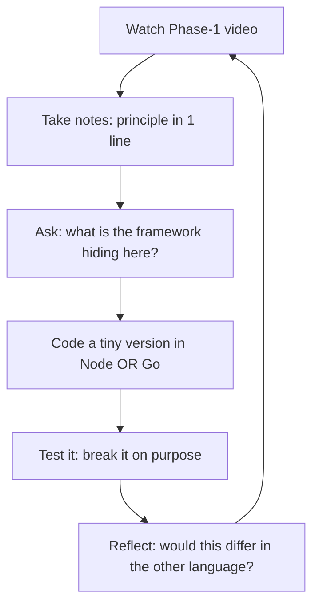
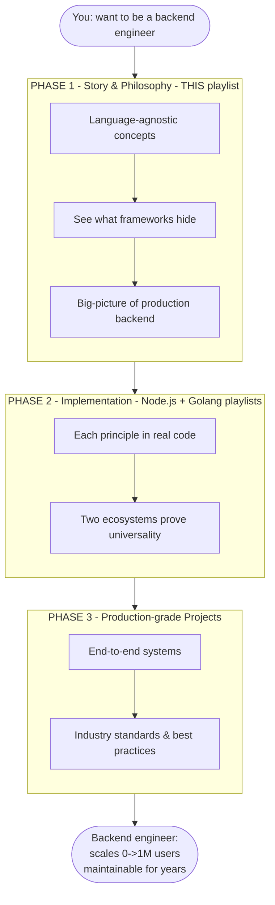

# 2.1 — Deepening "Walk the Path of a True Backend Engineer"

> **Companion to:** `02-walk-the-path.md` (Video 2)
> **Purpose:** Extra clarifications, analogies, and visualizations to *solidify* the 3-phase model so the concept really clicks.
> These points expand on Video 2's context; they are not new video content.

---

## A. The One-Sentence Mental Model

> **Phase 1 = understand the map. Phase 2 = drive the car. Phase 3 = plan and run a real delivery business.**

Hold that analogy; we'll map it explicitly below.

---

## B. Analogy: Learning to Cook (solidifies "why this order")

| Course Phase | Cooking equivalent | Why it fits |
|--------------|-------------------|-------------|
| **Phase 1 — Story & Philosophy** | Learn *what heat does to food*, *why salt enhances flavor*, *how ingredients combine* — **without** being tied to one recipe book. | You grasp universal principles, not just "press button 3 on the Instant Pot." |
| **Phase 2 — Implementation** | Actually cook in **two kitchens** (say, Italian and Japanese) using those principles. | Same principle ("maillard reaction") looks different per cuisine — proving it's universal. |
| **Phase 3 — Production-grade** | Run a **real restaurant** night after night: menus, inventory, health standards, busy Friday rush. | Only here do integration + trade-offs + reliability matter. |

This is exactly why Video 1 warned against "framework tunnel vision": learning *only* the Instant Pot's buttons leaves you helpless in a different kitchen.

---

## C. What Exactly Do Frameworks "Abstract" Away?

Video 2 says frameworks hide concepts "we use every day." Here is the **stack** those hidden concepts live in, bottom to top:

**The hidden concepts** (taught visibly in Phase 1) sit *inside* the Framework + Runtime layers. When you only use a framework, you call `app.get('/users', ...)` and never see the TCP handshake, the middleware loop, or the serialization step. Phase 1 pulls back that curtain.

### Layer cheat-sheet
| Layer | Job | Examples of what it hides |
|-------|-----|---------------------------|
| Framework | Structures your app | routing, middleware, validation, auth |
| Runtime | Runs your code | event loop vs threads, garbage collection |
| OS | Talks to hardware | sockets, files, signals (SIGTERM…) |
| Hardware/Net | Physical limits | CPU, RAM, disk, the internet |

---

## D. Why Node.js **and** Golang? (a clarifying comparison)

The instructor picked the two languages he uses daily. Understanding *why these two* helps you appreciate Phase 2.

| Dimension | Node.js | Golang (Go) |
|-----------|---------|-------------|
| Style | Single-threaded event loop, async/await | Multi-threaded via lightweight "goroutines" |
| Strength | Lots of I/O (APIs, proxies) | High concurrency + CPU work, fast startup |
| Typing | Dynamic (JS) | Static (compiled) |
| Feels like | "JavaScript everywhere" | "C-like, but modern" |
| Postgres driver | `postgres.js` | `PGX` |

**The teaching trick:** a principle like *"open a DB connection, run a parameterized query, map rows → objects"* looks *different* in each — yet the **principle is identical**. That repetition is what burns the concept into your brain language-agnostically.

---

## E. What "Production-grade" Really Means (a checklist)

Video 2 promises systems that "scale to a million users and stay maintainable." Here's what that bar actually contains — your Phase-3 target:

| Attribute | What it protects against |
|-----------|--------------------------|
| Reliable / fault-tolerant | Crashes taking down everything |
| Scalable | Hitting a wall at 10k users |
| Secure | Data breaches, injection, auth bypass |
| Observable | "It's slow but we don't know why" |
| Maintainable | Only one person can touch it |
| Tested + CI/CD | Regressions shipping to prod |
| Documented | New devs lost for weeks |
| Performant + cached | Wasted money & slow responses |

---

## F. The Phase-1 → Phase-2 "One-to-One" Mapping (worked example)

The instructor said most Phase-1 videos get a matching implementation video. Concretely:

| Phase 1 principle (this playlist) | Phase 2 — Node.js implementation | Phase 2 — Golang implementation |
|-----------------------------------|----------------------------------|---------------------------------|
| HTTP & routing | Express `Router` + `app.get/post` | `net/http` / `gin` router |
| Serialization | `JSON.stringify` / `JSON.parse` | `encoding/json` |
| Auth | `jsonwebtoken` + middleware | `jwt` lib + middleware |
| Databases | Postgres via **postgres.js** | Postgres via **PGX** |
| Caching | `ioredis` client | `go-redis` client |
| Task queues | `bullmq` | `asynq` |

> 💡 Study habit: as you watch Phase 1, write the principle in one line, then *later* fill in the Node and Go column from Phase 2. That blank table is your personal "concept → code" map.

---

## G. How to *Internalize* This (active-learning loop)

To actually "solidify" the concept (your goal), don't just watch — loop:

1. **Watch** the Phase-1 video.
2. **Note** the principle in one sentence.
3. **Question** what a framework normally hides.
4. **Code** a 20-line version yourself (Node *or* Go).
5. **Break it** on purpose (send bad input, kill the DB) to see failure modes.
6. **Reflect** on whether the principle would change in the other language. → back to step 1.

---

## H. Common Beginner Confusions (cleared up)

- **"Is Phase 1 enough to get a job?"** → No, by itself. It's the *foundation*. Phase 2 (code) + Phase 3 (projects) are what make you employable. But Phase 1 is what makes you **not** a "framework parrot."
- **"Do I need to learn BOTH Node and Go?"** → No. Pick the track that matches your goals; the *second* track is optional proof the concept is universal. One language done deeply > two skimmed.
- **"What's the difference between a framework and a library again?"** → A **library** is something *you call* (`date.format()`). A **framework** is something that *calls you* — it owns the flow (Express decides when your route handler runs).
- **"Runtime vs language?"** → The **language** is the rules/syntax; the **runtime** is the program that actually executes it (Node.js executes JS; the JVM executes Java).

---

## I. Summary Diagram — The Whole Journey on One Page

---

## J. Key Reminders

- This `2.1` doc is **supplemental** — it explains and visualizes Video 2's ideas; it adds no new video facts.
- Revisit section **G** (the learning loop) before every Phase-1 video — it's the habit that turns "watched" into "understood."
- When Video 5 (HTTP) arrives, you'll see *exactly* which framework curtain is being pulled back.
