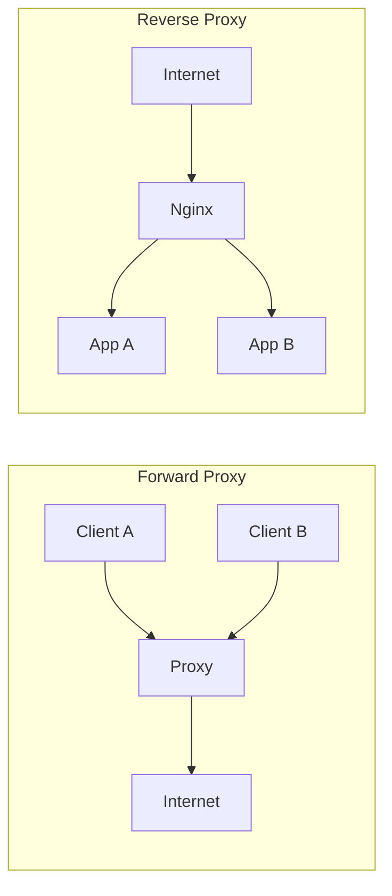
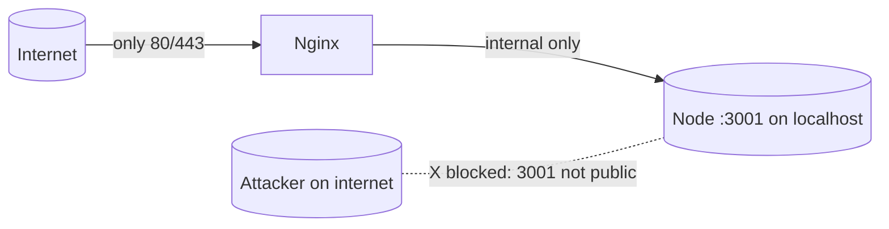
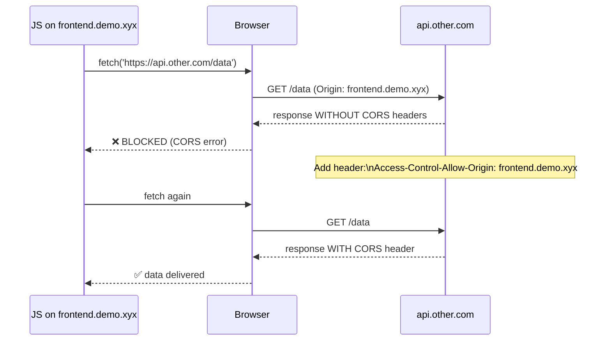
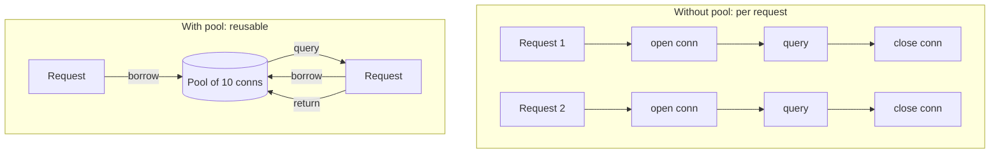
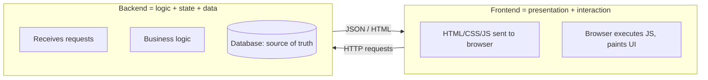
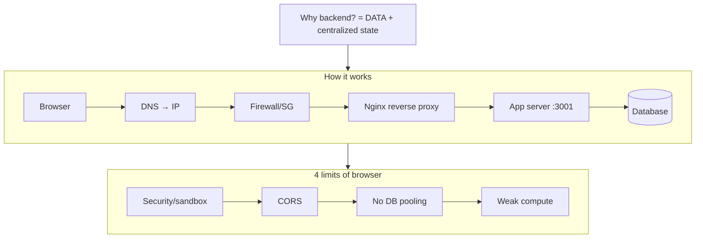

# 3.1 — Deepening "What Is a Backend"

> **Companion to:** `03-what-is-backend.md` (Video 3)
> **Purpose:** Extra clarifications, deeper diagrams, and a tiny runnable demo to **solidify** the request-path, reverse-proxy, CORS, and connection-pool concepts.
> Content expands Video 3's context; it adds no new video facts.

---

## A. Zooming Into Each Hop (the "why" behind every layer)

```mermaid
flowchart TD
    subgraph NET[Internet]
        B[Browser] --> DNS[(DNS resolver)]
    end
    DNS -->|returns IP| B
    B -->|TCP/IP to IP:443| SG[Security Group\n(default DENY)]
    SG -->|allow 443| NG[Nginx]
    NG -->|proxy_pass localhost:3001| APP[Node app]
    APP -->|SQL over pooled socket| DB[(Database)]
```

| Layer | Why it must exist | What breaks if missing |
|-------|------------------|------------------------|
| **DNS** | Humans remember names, machines need IPs. | No way to reach the server by name. |
| **Security group / firewall** | Unfiltered ports = open attack surface. | Anyone can SSH in, exploit services. |
| **Nginx (reverse proxy)** | One public face for many internal services; central TLS & routing. | Each app must handle TLS & routing itself; no central control. |
| **Node app** | Runs your business logic. | Nothing to process requests. |
| **Connection pool → DB** | Reuse connections under heavy load. | DB overwhelmed by connect/disconnect storms. |

---

## B. Forward Proxy vs Reverse Proxy (a common confusion)

People mix these up. Here's the distinction the video implies (Nginx is a **reverse** proxy):



- **Forward proxy**: sits *in front of clients* (corporate network hides client identity, caches, filters).
- **Reverse proxy**: sits *in front of servers* (Nginx hides backend topology, does TLS, load-balances). The client doesn't know which app answered.

---

## C. Why "localhost:3001" and Not the Public IP?

Inside the EC2 machine, the app binds to `localhost` (127.0.0.1) on port 3001. That means:
- It is **not directly reachable from the internet** (only Nginx, on the public-facing ports 80/443, can reach it).
- This is **defense in depth**: the app is shielded behind Nginx + the security group.



---

## D. SSL/TLS & certbot — the 30-second version

- **HTTP** = plain text. Anyone on the network path can read it.
- **HTTPS** = HTTP wrapped in **TLS** encryption. Needs a **certificate** proving the server is who it claims.
- **certbot** (Let's Encrypt) auto-generates & renews that certificate for free, so Nginx can serve HTTPS without manual cert work.

```
Browser ──HTTPS (TLS)──> Nginx (terminates TLS) ──HTTP──> localhost:3001
```

> The app speaks plain HTTP *internally*; encryption happens at Nginx. This is normal and fine because the internal hop is on the same machine.

---

## E. CORS — Why the Browser Says "No" Cross-Domain

The video mentions CORS as a browser policy. Here's the mechanism:



**Rule of thumb:** CORS is *enforced by the browser*, not the server. A backend-to-backend call has no such restriction — another reason backend logic can't live in the browser.

---

## F. Connection Pooling — The Database Problem

The video's key DB point: browsers can't pool; servers must. Why pooling matters:



- Opening a TCP + DB connection is **expensive** (handshake, auth).
- At thousands of req/s, "open/close every time" **overwhelms the DB**.
- A **pool** keeps N connections warm; each request borrows and returns one.
- If browsers connected directly, *every user* would open their own connection → DB dies. Servers centralize and pool instead.

---

## G. Tiny Runnable Demo (solidify by building)

Run this locally to *feel* the path Browser → Node server. No AWS/Nginx needed.

**`server.js`** — a minimal backend on port 3001:
```js
const http = require('http');

const server = http.createServer((req, res) => {
  // A backend PERSISTS/ACTS on data; here we just return some.
  res.writeHead(200, { 'Content-Type': 'application/json' });
  res.end(JSON.stringify({
    message: 'Hello from the backend',
    users: [{ id: 1, name: 'Ada' }, { id: 2, name: 'Linus' }]
  }));
});

server.listen(3001, () => console.log('Backend listening on http://localhost:3001'));
```

Run it: `node server.js`, then open `http://localhost:3001` in your browser. You just hit a backend directly (skipping DNS/Nginx, which only matter for the *public* internet path).

**`client.html`** — a frontend that *fetches* from the backend (this is the browser-runtime model):
```html
<script>
  fetch('http://localhost:3001')
    .then(r => r.json())
    .then(data => console.log('Got from backend:', data));
</script>
```

> Open `client.html` and watch the console — the backend *processed on the server* and the browser *just received the result*. That division is the whole point of Video 3.

---

## H. Frontend vs Backend — A Clean Mental Picture



- **Frontend** answers: *What does the user see and click?*
- **Backend** answers: *What is true, who is allowed, and what happens next?*

---

## I. Common Beginner Confusions (cleared)

- **"Isn't the browser also a server?"** → No. The browser *requests*; a server *listens and responds*. Next.js blurs this because it has a server that *pre-renders* HTML, but the code it ships still *runs in your browser* for interactivity.
- **"Why Nginx if my Node app can listen on 443?"** → You *can*, but Nginx gives centralized TLS, routing to many apps, and easy static-file serving. At scale, the reverse proxy is standard.
- **"What's the difference between port 80 and 443?"** → 80 = plain HTTP; 443 = HTTPS (encrypted). Modern sites redirect 80 → 443.
- **"If browsers are sandboxed for safety, why do we need a backend for safety too?"** → The sandbox protects the *user's* machine from malicious sites. The backend protects the *company's* data and enforces rules the client can't be trusted to enforce.
- **"Can't a PWA or static site replace a backend?"** → For pure display, yes. But the moment you need shared state (likes, accounts, notifications), you need a centralized backend.

---

## J. One-Page Recap Diagram



---

## K. Study Check

Before moving on, you should be able to:
- [ ] Draw the 6-hop request path from memory.
- [ ] Explain what a reverse proxy and a security group each *protect or enable*.
- [ ] Say, in one sentence, why a browser can't talk directly to Postgres.
- [ ] Describe the like→notification flow in backend terms (identify → persist → notify).
- [ ] Run the tiny `server.js` demo and fetch from it.
