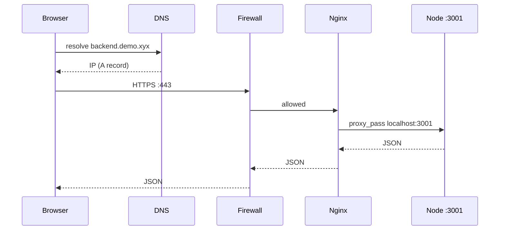
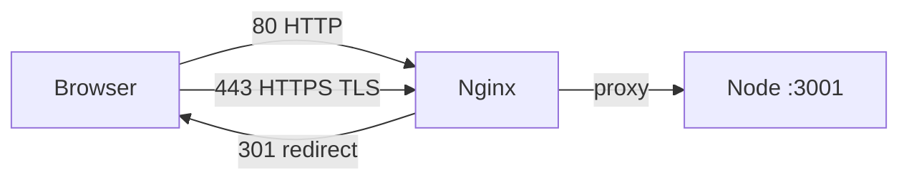

# 3_questions.md — Practice Questions (Video 3: What Is a Backend)

> Practical questions to **test and solidify** Video 3's concepts. Each has a detailed, simple explanation and, where useful, runnable **code**. Try to answer *before* reading the solution.

---

## Q1. Trace a request: what happens from typing a URL to seeing JSON?

**Question:** A user opens `https://backend.demo.xyx/users` in their browser. Walk through every hop the request takes until the JSON response comes back.

<details>
<summary>Show detailed answer</summary>

The path taught in the video:

1. **Browser** initiates a request to `backend.demo.xyx`.
2. **DNS** resolves the domain via an **A record** to the EC2 public IP (e.g., `12.34.56.78`).
3. The request travels over the internet to that IP on **port 443** (HTTPS).
4. **AWS Security Group (firewall)** checks the port is allowed; otherwise it's dropped.
5. **Nginx** (reverse proxy) receives it on 443, and **proxies** it to `localhost:3001`.
6. The **Node server** on `:3001` handles the route `/users`, reads/prepares data, and returns JSON.
7. The response travels back the same chain to the browser, which renders it.



</details>

---

## Q2. What is a reverse proxy, and why put Nginx in front of a Node server? Show a minimal config.

**Question:** Why not let the Node app listen directly on 443? What does Nginx do, and what does a basic config look like?

<details>
<summary>Show detailed answer</summary>

A **reverse proxy** sits in front of your app servers and forwards requests to them. Benefits:
- Centralizes **TLS/HTTPS** termination (one place manages certs via certbot).
- Routes many domains/subdomains to many internal apps.
- Can serve static files, rate-limit, and add security headers.

A minimal Nginx config that mirrors the video (port 80 → 443 → `localhost:3001`):

```nginx
# Redirect all HTTP to HTTPS
server {
    listen 80;
    server_name backend.demo.xyx;
    return 301 https://$host$request_uri;
}

# HTTPS server proxies to the Node app
server {
    listen 443 ssl;
    server_name backend.demo.xyx;

    ssl_certificate     /etc/letsencrypt/live/backend.demo.xyx/fullchain.pem;
    ssl_certificate_key /etc/letsencrypt/live/backend.demo.xyx/privkey.pem;

    location / {
        proxy_pass http://localhost:3001;   # the Node server
        proxy_set_header Host $host;
        proxy_set_header X-Real-IP $remote_addr;
        proxy_set_header X-Forwarded-For $proxy_add_x_forwarded_for; # real client IP chain
        proxy_set_header X-Forwarded-Proto $scheme;                  # tell app it was HTTPS
    }
}
```

> On modern nginx (≥ 1.25) enable HTTP/2 with a separate directive:
> `listen 443 ssl;` then `http2 on;`. The old `listen 443 ssl http2;` form is
> deprecated. The `X-Forwarded-For` header matters because, behind a proxy, your
> app otherwise sees only the proxy's IP as the client — see
> `network-qa/01-why-ip-address-changes.md`.

The browser only ever sees Nginx on 443; the Node app stays on `localhost:3001`, shielded from the public internet.

</details>

---

## Q3. Why can't the browser connect directly to a Postgres database? Explain connection pooling.

**Question:** The video says browsers lack "native DB drivers" and can't maintain "persistent connections." Explain *why* this matters and what a **connection pool** solves.

<details>
<summary>Show detailed answer</summary>

**Why not the browser:**
- Browsers run **sandboxed** JS with no native database drivers (no `pg`, no raw sockets to a DB).
- Even if they could, *every user* would open their **own** connection to the database → thousands of clients → the DB is overwhelmed and exposed.
- Browsers also can't keep **persistent, pooled** connections.

**What a pool does (backend side):** A backend keeps a small set of *reusable* open connections. Each request borrows one, runs its query, and returns it — instead of opening/closing a connection per request (which is slow and expensive at scale).

```js
// Node + 'pg' driver — connection pooling in practice
const { Pool } = require('pg');
const pool = new Pool({ max: 10 }); // reuse up to 10 connections

// For a SINGLE query, let the pool check out and release for you — simpler and
// impossible to leak. `pool.query` borrows a connection and returns it automatically.
app.get('/users', async (req, res, next) => {
  try {
    const result = await pool.query('SELECT * FROM users');
    res.json(result.rows);
  } catch (err) {
    next(err); // Express 4 does NOT auto-forward async rejections; without this the response hangs
  }
});

// Manual checkout (pool.connect + release) is only needed for a TRANSACTION,
// where several queries must run on the SAME connection:
//   const client = await pool.connect();
//   try { await client.query('BEGIN'); ...; await client.query('COMMIT'); }
//   catch (e) { await client.query('ROLLBACK'); throw e; }
//   finally { client.release(); }   // release in finally, or you leak the connection
```

Without the pool, thousands of requests/sec would each do a full TCP+auth handshake to Postgres and likely crash it.

</details>

---

## Q4. What is CORS and why does the browser block cross-origin requests?

**Question:** Frontend JS on `frontend.demo.xyx` tries to `fetch('https://api.other.com/data')` and gets blocked. What's happening, and how does the server fix it?

<details>
<summary>Show detailed answer</summary>

**CORS** (Cross-Origin Resource Sharing) is a **browser-enforced** security policy. A page's JS may only call APIs on its *own* origin unless the target server explicitly allows it via response headers.

The browser sends an `Origin` header and expects back something like:

```http
Access-Control-Allow-Origin: https://frontend.demo.xyx
```

A tiny Express server enabling CORS for one origin:

```js
const express = require('express');
const app = express();

app.use((req, res, next) => {
  res.setHeader('Access-Control-Allow-Origin', 'https://frontend.demo.xyx');
  res.setHeader('Access-Control-Allow-Methods', 'GET,POST');
  res.setHeader('Access-Control-Allow-Headers', 'Content-Type');
  // A POST with Content-Type: application/json triggers a *preflight* OPTIONS
  // request. We must answer it (204, no body) or the real request never runs.
  if (req.method === 'OPTIONS') return res.sendStatus(204);
  next();
});

app.get('/data', (req, res) => res.json({ ok: true }));
app.listen(3001);
```

> In real projects, use the `cors` npm package instead of hand-rolling headers —
> it handles preflight, methods, and credentials correctly.

Key point: **CORS is enforced by the browser, not the network.** A backend calling another backend has no such restriction — another reason backend logic can't live in the browser. Note the two-step dance for non-simple requests: the browser sends a **preflight `OPTIONS`** asking "am I allowed?", and only sends the real request if the server's `Access-Control-Allow-*` headers say yes.

</details>

---

## Q5. Write a minimal backend AND a frontend fetch that proves "backend processes, browser receives."

**Question:** Show (a) a tiny Node HTTP server returning JSON, and (b) a browser `fetch` that consumes it. Explain which part runs *where*.

<details>
<summary>Show detailed answer</summary>

**(a) Backend — `server.js`** (runs **on the server**):
```js
const http = require('http');
const server = http.createServer((req, res) => {
  res.writeHead(200, {
    'Content-Type': 'application/json',
    'Access-Control-Allow-Origin': '*', // let the browser page read this response
  });
  res.end(JSON.stringify({ message: 'processed on the server', users: [{ id: 1, name: 'Ada' }] }));
});
server.listen(3001, () => console.log('Backend on :3001'));
```

> **Why the CORS header?** If you open the HTML file below from `file://` or a
> different port, the `fetch` is *cross-origin*. Without
> `Access-Control-Allow-Origin`, the browser makes the request but **blocks your
> JS from reading the response**. The `*` header above fixes the demo. (If you
> instead just point the browser bar directly at `http://localhost:3001`, that's
> a top-level navigation, not a `fetch`, so CORS doesn't apply and you'd see the
> raw JSON either way.)

**(b) Frontend — runs **in the browser**:
```html
<script>
  fetch('http://localhost:3001')
    .then(r => r.json())
    .then(data => console.log('Received from backend:', data));
</script>
```

**Where things run:** the backend *computes* the response on the server and sends it; the browser only *receives and renders* it. That split — server does the work, client shows the result — is the core idea of Video 3.

</details>

---

## Q6. Model the "like → notification" flow as backend pseudo-code.

**Question:** Using the Instagram example from the video, sketch the backend handler steps: identify user → persist like → find owner → notify.

<details>
<summary>Show detailed answer</summary>

```js
// POST /posts/:postId/like
app.post('/posts/:postId/like', authMiddleware, async (req, res) => {
  const likerId = req.user.id;            // 1. identify WHO clicked
  const postId  = req.params.postId;

  // 2. persist the action in the database
  await db.query(
    'INSERT INTO likes (user_id, post_id) VALUES ($1, $2)',
    [likerId, postId]
  );

  // 3. find the post owner
  const { rows } = await db.query('SELECT user_id FROM posts WHERE id = $1', [postId]);
  const ownerId = rows[0].user_id;

  // 4. trigger a notification to the owner
  await notify(ownerId, `${req.user.name} liked your post`);

  res.status(201).json({ ok: true });
});
```

This is exactly the centralized, stateful coordination a backend exists for: it holds the data and makes cross-user things happen.

</details>

---

## Q7. Port 80 vs 443, and what does certbot actually do?

**Question:** The video allows ports 80 and 443 and mentions certbot. What's the difference between the two ports, and what problem does certbot solve?

<details>
<summary>Show detailed answer</summary>

- **Port 80** = plain **HTTP** (readable by anyone on the path).
- **Port 443** = **HTTPS** (HTTP + TLS encryption).
- Modern setups listen on 80 only to **redirect** to 443.

**certbot** (from Let's Encrypt) automatically obtains and renews a free **TLS certificate**, so Nginx can serve HTTPS without you manually buying/configuring certs. Without TLS, any data (passwords, tokens) sent on port 80 is visible to attackers.



</details>

---

## Q8. (Stretch) Could you build a backend *without* Nginx or AWS — just on your laptop?

**Question:** The video used AWS + Nginx. Is all that required to have a "backend"?

<details>
<summary>Show detailed answer</summary>

**No.** AWS and Nginx are *deployment* choices, not what makes something a backend. The defining trait is: **a process listening for requests and serving/processing data.**

You already did this in Q5 — `node server.js` on `localhost:3001` *is* a backend. AWS gives you a public IP and scaling; Nginx gives you TLS and routing. For local development or learning, a single Node process is a perfectly valid backend. The cloud/proxy layers only become necessary when you must be **reachable from the internet** and **handle production load**.

</details>

---

## How to use this file

1. Read the question, close the answer, and try to explain it aloud or in code.
2. Open the answer; compare. If you got a hop or concept wrong, re-read `03-what-is-backend.md` §3–§6.
3. Actually **run** the code in Q2/Q3/Q5 — seeing the request path in your own terminal cements it.
4. Come back after Video 5 (HTTP); the "request/response" messages referenced here get explained there.
